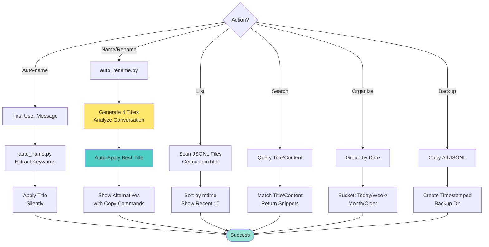

# Conversations Manage

Manage Claude Code conversation history: name, organize, search, and maintain conversations.

**New: Auto-Naming** - Conversations are now automatically given a working name based on the first user message. No more untitled conversations! Users can still rename with `/name` command.

## Common Failure Modes & Troubleshooting

### 🔴 Title Not Appearing in Claude History

**Symptom:** Renamed conversation but title doesn't show in Claude UI

**Possible Causes:**
1. **Script name mismatch**: `suggest_names.py` vs `suggest_titles.py`
   - **Fix:** Check for symlink: `ls -la .claude/skills/conversations-manage/suggest_names.py`
   - If missing: `ln -s suggest_titles.py suggest_names.py`

2. **Title suggested but not saved**: Only generated suggestions without calling rename
   - **Fix:** Must call `rename_conversation.py` to persist the title
   - **Verify:** Check JSONL file for `customTitle` field

3. **Wrong conversation file**: Renamed wrong or old conversation
   - **Fix:** Script uses most recent by mtime - check if correct file
   - **Verify:** `ls -lt ~/.claude/projects/*/‌*.jsonl | head -5`

4. **UI cache issue**: Claude UI hasn't refreshed
   - **Fix:** Refresh Claude window or restart Claude
   - **Verify:** Check JSONL directly for `type: "custom-title"` entry

### 🟡 Verification Steps

After renaming, verify success:
```bash
# Check the JSONL file has customTitle
grep customTitle ~/.claude/projects/*/*.jsonl | tail -1

# Should show something like:
# {"type":"custom-title","customTitle":"🧲 Your Title Here",...}
```

### 🟢 Complete Renaming Flow

1. **Generate suggestions** → `suggest_titles.py` (now with emojis!)
2. **User selects title** → Choice captured
3. **Apply rename** → `rename_conversation.py` writes to JSONL
4. **Verify in file** → Check for `customTitle` entry
5. **Confirm in UI** → Should appear in Claude history

### 🔍 Diagnostic Tool

Run diagnosis if rename isn't working:
```bash
# Diagnose current conversation
python3 .claude/skills/conversations-manage/diagnose_rename.py

# Diagnose specific conversation
python3 .claude/skills/conversations-manage/diagnose_rename.py [conversation-id]
```

The diagnostic will:
- ✅ Check if all scripts exist and are linked correctly
- ✅ Find the conversation JSONL file
- ✅ Search for `customTitle` entries
- ✅ Report exact line numbers where title appears
- ❌ Identify missing titles and suggest fixes

## Workflow



## Configuration

**Conversation files**: `/Users/min/.claude/projects/-Users-min-Documents-Projects-DigitalBrain/*.jsonl`

**Personal history**: `personal/conversational-history/`

**SQLite index**: `~/.claude/conversation_index.db` (200x faster queries)

## Core Operations

### 0. Auto-Name on Startup (NEW)

**Automatic naming** happens silently after first user message:
- Extracts keywords from user's first message
- Generates descriptive title (e.g., "Fix API bug", "Create new skill")
- Runs in background (non-blocking, < 100ms)
- Marked with `"autoGenerated": true` flag

**Script**: `auto_name.py --message "user message"`

### 1. Name/Rename Conversation

**Command**: `/name` (previously `/rename`)

**NEW BEHAVIOR**:
- **Automatically picks and applies the best title** based on conversation analysis
- **Shows 4 alternative suggestions** with copy-paste commands for easy selection
- **No more multiple prompts** - instant naming with options to change

**Usage**:
```bash
# Auto-rename with best suggestion (default)
python3 .claude/skills/conversations-manage/auto_rename.py

# Pick a specific suggestion (1-4)
python3 .claude/skills/conversations-manage/auto_rename.py --pick 2

# Use custom title
python3 .claude/skills/conversations-manage/auto_rename.py --custom "My Custom Title"
```

**⚠️ CRITICAL**: Proper naming requires TWO steps:
1. Update `customTitle` in metadata
2. Add `custom-title` type entry to JSONL

The scripts handle both steps automatically!

**Correct format**:
```json
{"type": "custom-title", "customTitle": "Your Title", "sessionId": "conversation-id"}
```

See `references/rename-implementation.md` for details.

### 2. Suggest Titles

When user hasn't provided title, analyze conversation and generate 4 suggestions:

**Analysis criteria**:
- Actions performed (create, fix, update, search)
- Files/directories touched
- Technologies used
- Skills invoked
- User's original intent

**Title design**:
- Start with action verb
- Include specific context (files/tech)
- Different opening for each (easy scanning)
- Keep differentiating info early

See `references/title-generation.md` for examples.

### 3. List Recent

Lists last 10 conversations with titles and dates.

Script: `list_recent_conversations(limit=10)` reads JSONL files, extracts customTitle, sorts by mtime.

### 4. Search Conversations

Search by title or content with `search_conversations(query, search_content=False)`.

Returns: ID, title, file, snippet around match.

### 5. Organize by Date

Groups conversations: today, this_week, this_month, older.

Useful for understanding conversation recency patterns.

### 6. Backup

Creates timestamped backup in `personal/backups/conversations/backup_YYYYMMDD_HHMMSS/`.

Copies all JSONL files with metadata preserved.

## Usage Examples

**Auto-naming**: Happens automatically on first user message (no action needed)

**Name/Rename with auto-pick**: "/name" → Instantly applies best title + shows 4 alternatives

**Name with specific title**: "/name to 'AI Safety Research'" → Updates to your custom title

**List**: "Show recent conversations" → Last 10 with dates

**Search**: "Find conversations about job board" → Matches + snippets

**Organize**: "Organize my conversations" → Grouped by recency

**Backup**: "Backup conversation history" → Timestamped copy

## Implementation Details

**File format**: JSONL (one JSON object per line)

**Custom title handling**: Use dedicated `type: "custom-title"` objects (preferred), not embedded fields

**Performance**: SQLite index for large histories (<100ms vs 15-23s)

**Error handling**: Check file existence, handle malformed JSON, create backups before changes

See `references/implementation-details.md` for file structure and custom title field handling.

## Integration

Works with:
- **conversational-history** - Search/analyze content
- **saving-memories** - Extract insights
- **waking-up** - Load context from recent conversations

## Common Fail Modes

**❌ Incomplete rename**: Only updating metadata won't show in UI
- **Fix**: Use `rename_conversation.py` script (handles both steps)

**❌ Slow searches**: Scanning all JSONL files takes 15-23s
- **Fix**: Use SQLite index (`~/.claude/conversation_index.db`)

**❌ Lost titles**: Multiple conflicting titles in file
- **Fix**: Use v2 script with detection + backup

See `references/troubleshooting.md` for detailed solutions.

## Resources

- `references/rename-implementation.md` - Rename workflow and code
- `references/title-generation.md` - Title suggestion examples
- `references/implementation-details.md` - File structure and technical details
- `references/troubleshooting.md` - Common issues and solutions
- `rename_conversation.py` - Main rename script
- `suggest_titles.py` - Title generation script
