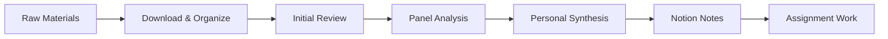

# Courses

General workflow framework for managing any online or academic course. This skill provides reusable patterns and workflows that work across different course platforms and subjects.

## Usage

Triggers:
- "course workflow"
- "process course materials"
- "course setup"
- "study workflow"
- When starting or managing any course

## Course Workflow Framework

### 1. Initial Course Setup
```
1. Create course structure in downloads/
2. Set up Notion workspace for notes
3. Download syllabus and course overview
4. Map out unit/module structure
5. Identify key resources and deadlines
6. Create tracking system for progress
```

### 2. Unit/Module Processing Workflow

#### Pre-Unit Preparation
- [ ] Review unit objectives and learning outcomes
- [ ] Download all unit materials (readings, slides, videos)
- [ ] Create Notion page for unit notes
- [ ] Check assignment requirements and deadlines

#### Content Processing
- [ ] **Initial Review:** Quick scan of all materials
- [ ] **Deep Dive:** Process materials using course-learning-panels
- [ ] **Synthesis:** Create summary notes in Notion
- [ ] **Discussion Prep:** Note questions and discussion points

#### Post-Unit Activities
- [ ] Complete assignments/exercises
- [ ] Participate in discussions/forums
- [ ] Review and consolidate notes
- [ ] Update progress tracking

### 3. Material Processing Pipeline



**Standard Processing Steps:**
1. **Download:** Use download-url skill for web materials
2. **Organize:** Sort into appropriate folders
3. **Analyze:** Use course-learning-panels for deep analysis
4. **Synthesize:** Create personal summaries
5. **Document:** Update Notion with key insights
6. **Apply:** Complete related assignments

### 4. Assignment Workflow

```
1. Read requirements carefully
2. Gather relevant materials and notes
3. Create draft in personal/drafts/
4. Review against rubric/requirements
5. Finalize and submit
6. Archive in Notion
```

### 5. Discussion/Forum Participation

```
1. Read discussion prompt
2. Review relevant materials
3. Draft response with citations
4. Engage with peer responses
5. Document key insights in Notion
```

## File Organization Pattern

```
downloads/[course-provider]/[course-name]/
├── syllabus/
├── units/
│   ├── unit-01/
│   │   ├── readings/
│   │   ├── slides/
│   │   ├── videos/
│   │   └── notes.md
│   ├── unit-02/
│   └── ...
├── assignments/
│   ├── assignment-01/
│   └── ...
├── discussions/
└── resources/
```

## Notion Structure Template

```
[Course Name]/
├── 📋 Course Overview
│   ├── Syllabus
│   ├── Schedule
│   └── Resources
├── 📚 Units/
│   ├── Unit 1: [Name]
│   │   ├── Learning Objectives
│   │   ├── Reading Notes
│   │   ├── Lecture Notes
│   │   ├── Key Concepts
│   │   └── Questions
│   └── ...
├── 📝 Assignments/
│   ├── Assignment 1
│   └── ...
├── 💬 Discussions/
│   ├── Week 1 Discussion
│   └── ...
└── 🎯 Progress Tracker
```

## Integration with Other Skills

### Core Integrations
- **course-learning-panels:** Process course materials with expert analysis
- **download-url:** Download course resources and readings
- **fetching-notion-content:** Access and update course notes
- **research-synthesis:** Synthesize multiple course resources
- **saving-memories:** Save key insights for future reference

### Platform-Specific Skills
- **bluedot-courses:** BlueDot-specific implementation
- [Add other platform-specific skills as created]

## Progress Tracking

### Weekly Review Checklist
- [ ] Review completed units/modules
- [ ] Check upcoming deadlines
- [ ] Update Notion progress tracker
- [ ] Process any backlog materials
- [ ] Plan next week's activities

### Course Completion
- [ ] Compile all notes into master document
- [ ] Archive important resources
- [ ] Save key learnings to memories/insights/
- [ ] Update skills with new knowledge
- [ ] Create summary/reflection document

## Commands

### Process Unit Materials
```bash
# Full unit processing
claude skill courses process-unit [unit-number]

# Quick review
claude skill courses review-unit [unit-number]
```

### Track Progress
```bash
# Update progress
claude skill courses update-progress [unit] [status]

# View current status
claude skill courses status
```

## Best Practices

1. **Consistent Structure:** Use the same folder/Notion structure for all courses
2. **Regular Processing:** Don't let materials accumulate - process weekly
3. **Active Synthesis:** Don't just consume - actively synthesize and question
4. **Panel Reviews:** Use course-learning-panels for complex/important materials
5. **Memory Integration:** Save cross-cutting insights to memories/insights/
6. **Progress Tracking:** Update tracking regularly to maintain momentum

## Notes

- This is a framework - adapt to specific course requirements
- Platform-specific details go in platform skills (e.g., bluedot-courses)
- Focus on reusable patterns that work across different courses
- Keep personal reflections and insights in personal/memories/