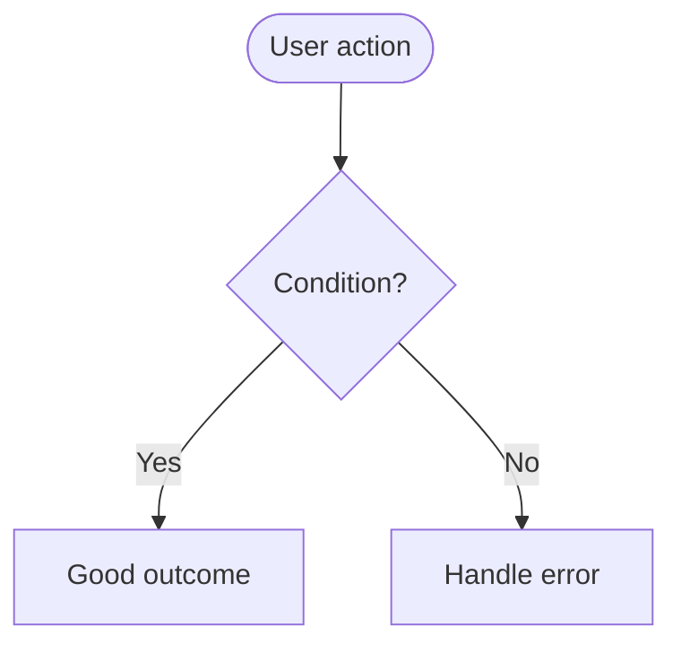
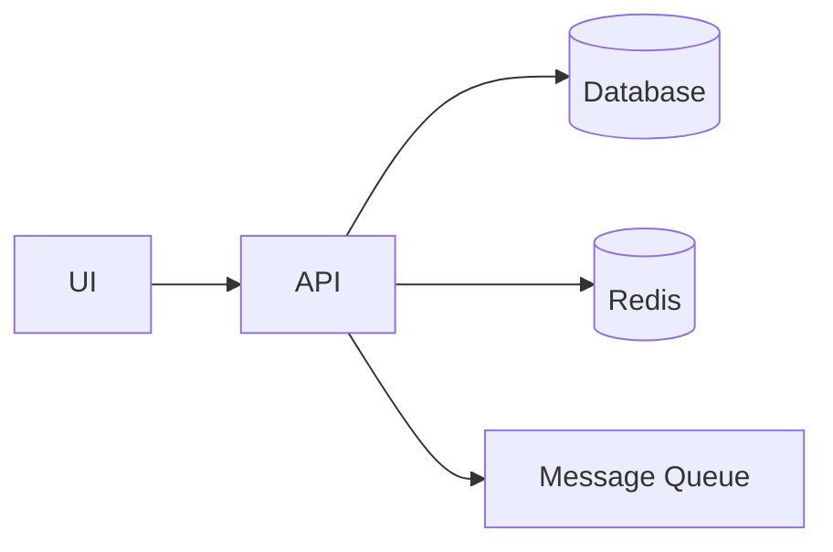
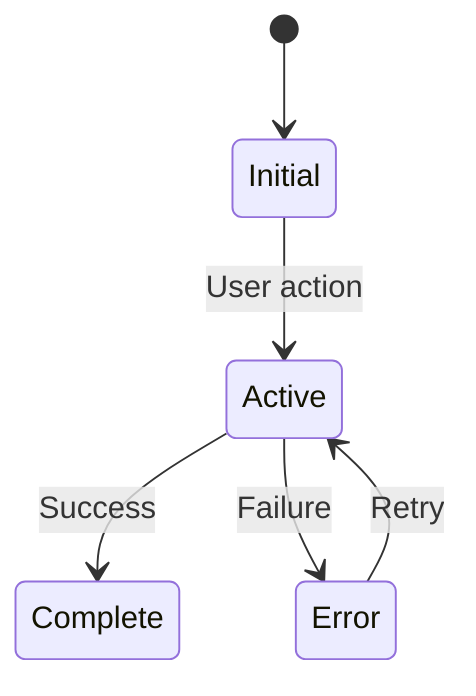
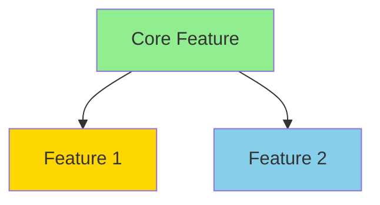
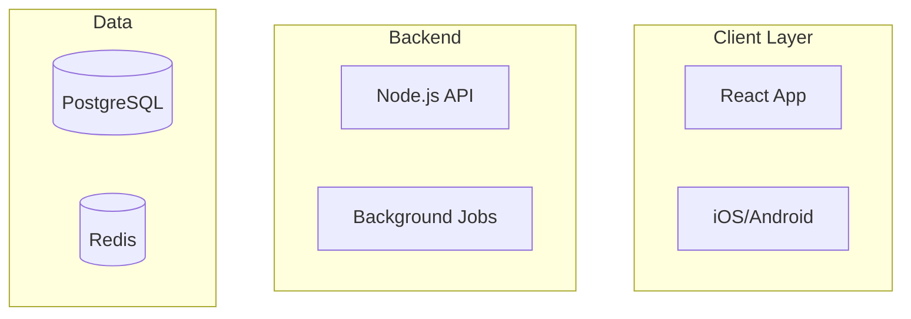
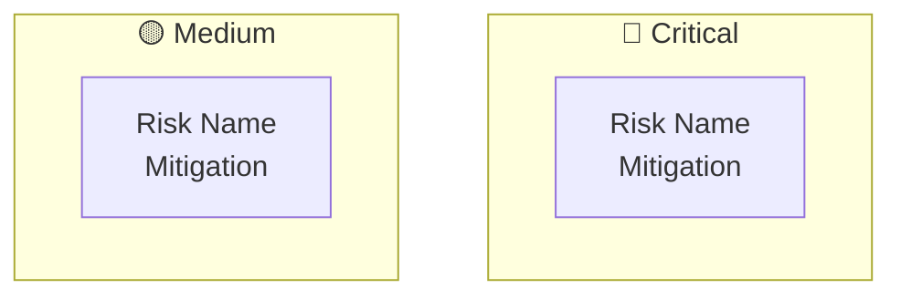
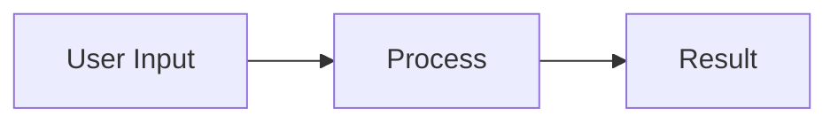
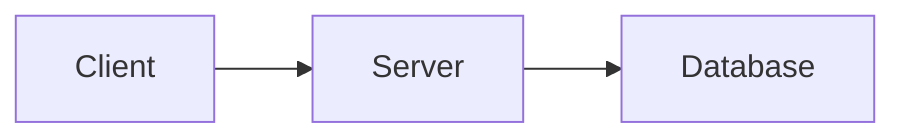
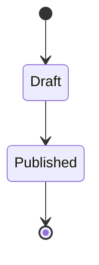
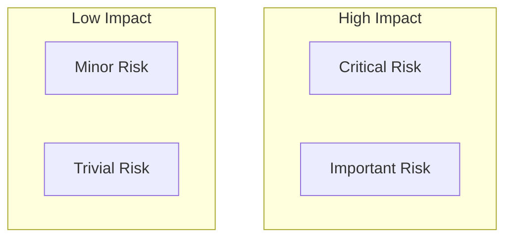

# Documentation Diagrams Guide

**Purpose**: Help fill out mermaid diagrams when creating feature and project documentation in `/docs/`.

## Quick Reference

### For Feature Documentation (`/docs/features/`)
1. **User Journey Flowchart** - Step-by-step user interaction
2. **System Component Diagram** - Data flow between services
3. **State Transition Diagram** - Feature states and triggers

### For Project Documentation (`/docs/projects/`)
1. **Feature Dependency Graph** - Feature relationships
2. **System Architecture Diagram** - Multi-layer architecture
3. **Risk Assessment Matrix** - Impact vs likelihood quadrants

---

## Feature Request Diagrams

### 1. User Journey Flowchart

**When to customize:**
- Map out the actual user steps for your feature
- Add decision points where users make choices
- Show different paths based on permissions/conditions
- Include error states and recovery flows

**How to fill it out:**


**Common patterns:**
- Authentication flows: Login → Validate → Success/Failure
- Form submissions: Input → Validate → Process → Confirm
- Search flows: Query → Filter → Results → Select
- Purchase flows: Browse → Cart → Checkout → Payment → Confirm

**Tips:**
- Use `([])` for start/end points
- Use `{}` for decisions
- Use `[]` for actions
- Add descriptive labels on arrows with `-->|Label|`

### 2. System Component Diagram

**When to customize:**
- Show which services your feature touches
- Map data flow between components
- Identify external dependencies
- Show caching layers or queues

**How to fill it out:**


**Component types:**
- **Frontend**: `UI[Web UI]`, `Mobile[Mobile App]`
- **Backend**: `API[REST API]`, `GraphQL[GraphQL]`
- **Data**: `DB[(PostgreSQL)]`, `Cache[(Redis)]`
- **External**: `Email[SendGrid]`, `Storage[S3]`

**Color coding:**
```mermaid
style UI fill:#e1f5ff  %% Blue for frontend
style DB fill:#ffe1e1  %% Red for data stores
style Email fill:#fff4e1  %% Yellow for external
```

### 3. State Transition Diagram

**When to customize:**
- Define all possible states for your feature
- Show what triggers state changes
- Document edge cases
- Add notes for complex transitions

**How to fill it out:**


**Common states:**
- **Lifecycle**: Draft → Published → Archived
- **Processing**: Pending → Processing → Complete
- **Approval**: Submitted → UnderReview → Approved/Rejected
- **Feature flags**: Disabled → Enabled → Deprecated

---

## Project Documentation Diagrams

### 4. Feature Dependency Graph

**When to customize:**
- List all features in your project
- Draw arrows showing dependencies
- Color-code by implementation status
- Group related features together

**How to fill it out:**


**Status colors:**
- 🟢 Green (`#90EE90`) - Completed
- 🟡 Yellow (`#FFD700`) - In Progress
- 🔵 Blue (`#87CEEB`) - Planned
- 🔴 Red (`#ff6b6b`) - Blocked

### 5. System Architecture Diagram

**When to customize:**
- Show all layers of your system
- Use subgraphs to group related components
- Include external services
- Show data flow directions

**How to fill it out:**


**Layer suggestions:**
- **Client Layer**: Web, Mobile, CLI, Desktop
- **API Gateway**: Load balancer, Rate limiter, Auth
- **Service Layer**: Microservices, APIs, Workers
- **Data Layer**: Databases, Caches, Queues, Files
- **External**: Third-party APIs, CDN, Analytics

### 6. Risk Assessment Matrix

**When to customize:**
- List actual project risks
- Place in appropriate quadrants
- Include mitigation strategies in node text
- Update as risks change

**How to fill it out:**


**Risk categories:**
- **🔴 Critical**: High Impact + High Likelihood
- **🟠 High**: High Impact + Low Likelihood
- **🟡 Medium**: Low Impact + High Likelihood
- **🟢 Low**: Low Impact + Low Likelihood

**Common risks:**
- **Technical**: Performance, scalability, security
- **External**: Vendor lock-in, API limits, compliance
- **Operational**: Team availability, knowledge gaps
- **Business**: Budget, timeline, scope creep

---

## Best Practices

### DO:
✅ Keep diagrams focused - one concept per diagram
✅ Use consistent naming across diagrams
✅ Add comments with `%%` for complex parts
✅ Update diagrams as implementation progresses
✅ Use descriptive labels on connections
✅ Color-code for quick visual understanding

### DON'T:
❌ Overcrowd diagrams - split if too complex
❌ Mix abstraction levels in one diagram
❌ Use technical jargon without context
❌ Leave placeholder text unchanged
❌ Create diagrams that won't be maintained

## Quick Templates

### Simple Feature Flow:


### Basic Architecture:


### Status Workflow:


### Risk Quadrant:


---

## Integration Tips

### When creating a new feature/project doc:

1. **Start with the template** - Don't delete example diagrams initially
2. **Customize incrementally** - Update one diagram at a time
3. **Keep examples as reference** - Comment them out with `%%` if needed
4. **Test rendering** - Preview in a mermaid viewer
5. **Iterate** - Diagrams evolve with understanding

### Linking diagrams to plans:

When creating plans in `/plans/`, reference the documentation diagrams:
- "See feature flow in `/docs/features/[name].md`"
- "Architecture detailed in `/docs/projects/[name].md`"
- "Risk matrix maintained in project docs"

This creates a connection between planning and documentation.

---

**Remember**: Diagrams are communication tools. They should clarify, not complicate. When in doubt, keep it simple and add detail only where it provides value.