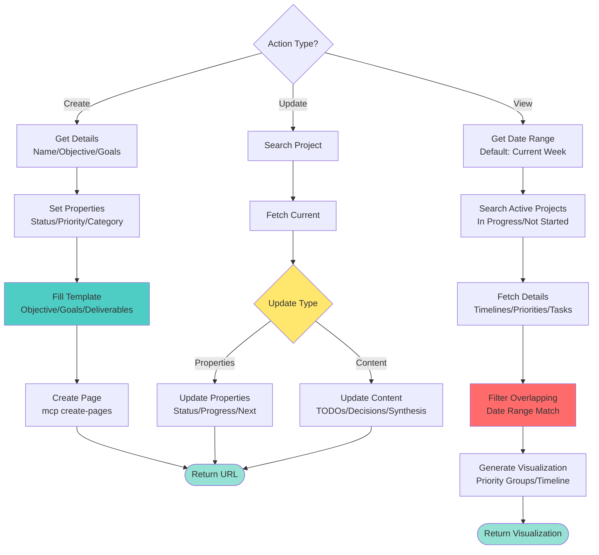

<!-- Notion Links (update here if URLs change) -->
<!-- Q1 Projects Database: https://www.notion.so/mindamyers/Q1-Projects-2026-3173caf373e0816d8f32dce784c1346f -->
<!-- Project Template: https://www.notion.so/mindamyers/P-PROJECT_TEMPLATE-31f3caf373e08041a6c0db48b2a0bb2b -->

# Managing Notion Projects

Create and update project pages in the Q1 Projects | 2026 database using the standard project template structure.

## Prerequisites

**CRITICAL**: Notion MCP must be authenticated. Check with `claude mcp list`. If "⚠ Needs authentication", user must run `claude mcp`.

**Data Source ID**: `collection://3173caf3-73e0-81d0-9628-000bac03a5a4`

## Workflow



## Create New Project

**Step 1: Get Details** - Ask/infer: name, objective, 3 goals, 3 deliverables, category, priority, dates, next action

**Step 2: Create Page**
```javascript
mcp__notion__notion-create-pages({
  parent: {data_source_id: "3173caf3-73e0-81d0-9628-000bac03a5a4"},
  pages: [{
    properties: {
      "Task/Project Name": "P | <name>",  // Always prefix "P | "
      "Objective": "<objective>",
      "Status": "Committed & Not Started",
      "Priority": "High|Medium|Low",
      "Category": "🔵 Job Search|📚 Learning|⚪ Other|...",
      "Tags": ["Planning"],
      "date:Start Date:start": "YYYY-MM-DD",
      "date:End Date:start": "YYYY-MM-DD",
      "Next": "<next-action>"
    },
    content: "<filled-template>"
  }]
})
```

**Step 3: Fill Template** - Use standard sections: Objective (callout), Goals (3 with rationale), Deliverables (3), Links, Pages, TODO, Key Decisions (date-stamped), Work Log

See `references/project-template-structure.md` for complete template.

## Update Existing Project

**Step 1: Search** → **Step 2: Fetch** → **Step 3: Update** (properties or content via `mcp__notion__notion-update-page`)

## View Overlapping Priorities

Check which projects overlap with a specific week's timeline and visualize priorities.

**Trigger Phrases:**
- "what projects overlap this week"
- "show weekly priorities"
- "what's scheduled for this week"
- "show all projects for [date range]"

**Workflow:**

1. **Get Date Range** - Default to current week (Sunday-Saturday) unless specified
2. **Search Active Projects** - Query Q1 Projects database for active/in-progress items
3. **Fetch Project Details** - Get timelines, priorities, status, next actions
4. **Filter Overlapping** - Projects with:
   - Start date before/during week AND (end date after/during week OR no end date)
   - Status: "In Progress" or "Committed & Not Started"
   - Exclude templates and completed projects
5. **Generate Visualization** - Priority-grouped timeline view

**Visualization Format:**

```
## 📅 Week of [Date Range] — Project Timeline
━━━━━━━━━━━━━━━━━━━━━━━━━━━━━━━━━━━━━━━━━━━━

### 🔴 HIGH PRIORITY PROJECTS

#### **1. [Project Name]** [icon]
- **Timeline:** Start → End (X weeks remaining)
- **Scale:** Large/Medium/Small (hours)
- **Status:** In Progress
- **This Week's Focus:**
  - [ ] Specific task 1
  - [ ] Specific task 2

### 🟡 MEDIUM PRIORITY PROJECTS
[Similar format]

### 🟢 LOW PRIORITY PROJECTS
[Similar format]

### 📊 Week at a Glance
[ASCII timeline showing project overlaps]

### 🎯 Key Deadlines & Milestones This Week
[Numbered list of critical dates]

### ⚠️ Critical Observations
[Analysis of gaps, conflicts, hidden work]

### 💡 Recommendation for Week Allocation
[Time split percentages and daily focus suggestions]
```

**Key Features:**

- **Priority Grouping**: High (🔴), Medium (🟡), Low (🟢)
- **Timeline Info**: Start/end dates, time remaining
- **Weekly Tasks**: Extracted from TODO sections and Next fields
- **Visual Timeline**: ASCII chart showing overlaps
- **Gap Analysis**: Identify infrastructure vs execution gaps
- **Time Allocation**: Suggested % split based on deadlines

**Integration Points:**

- Combines with **gtd** skill for executive function support
- Uses **para** organizational structure (Projects → Tasks)
- Can trigger **TodoWrite** for task tracking

## Common Properties

**Status**: Committed & Not Started | In Progress | Completed
**Priority**: High | Medium | Low
**Category**: 🔵 Job Search | 📚 Learning | 🟣 AI Safety | ⚪ Other
**Tags**: ["Planning"] | ["Execution", "Urgent"] | etc.

See `references/project-properties-schema.md` for full schema.

## Use Cases

**Meeting Prep**: Category: 📚 Learning, Tags: ["Planning", "Urgent"], Goals: read → synthesize → discussion points

**Research Synthesis**: Create project → run research-synthesis skill → add child page → update with summary + link

**Learning**: Category: 📚 Learning, Content: course objectives/modules/assignments/deadlines

**Job Search**: Category: 🔵 Job Search, Tags: ["Urgent"], Content: target companies/deadlines/interview prep

## Integration with Other Skills

**research-synthesis**: Create project → run synthesis → add child page → update parent with summary

**notion-edits**: Use for complex content updates

**fetching-notion-content**: Search/fetch existing projects for reference

## Best Practices

1. **Prefix with "P | "** - Consistent naming
2. **Complete template** - Even if brief, fill all sections
3. **Date decisions** - Add timestamp to Key Decisions
4. **Link related pages** - Use Pages section
5. **Update Progress** - Set % as work advances
6. **Update Status** - Move through workflow states
7. **Check TODOs** - Mark complete as you go

## Troubleshooting

**"⚠ Needs authentication"** → Run `claude mcp`
**"data_source_id not found"** → Verify collection:// ID
**"Invalid property value"** → Check property options match exactly
**Template not applying** → Paste full content, don't use template_id

## Resources

- `references/notion-links.md` - All Notion URLs and IDs
- `references/project-template-structure.md` - Complete template
- `references/project-properties-schema.md` - Full property definitions

## Related Skills

- **notion-edits** - Update/modify Notion pages
- **fetching-notion-content** - Search/retrieve Notion content
- **research-synthesis** - Multi-agent research analysis
- **gtd** - Executive function support and weekly planning (uses overlapping priorities view)
- **para** - PARA organizational structure that defines project categories
