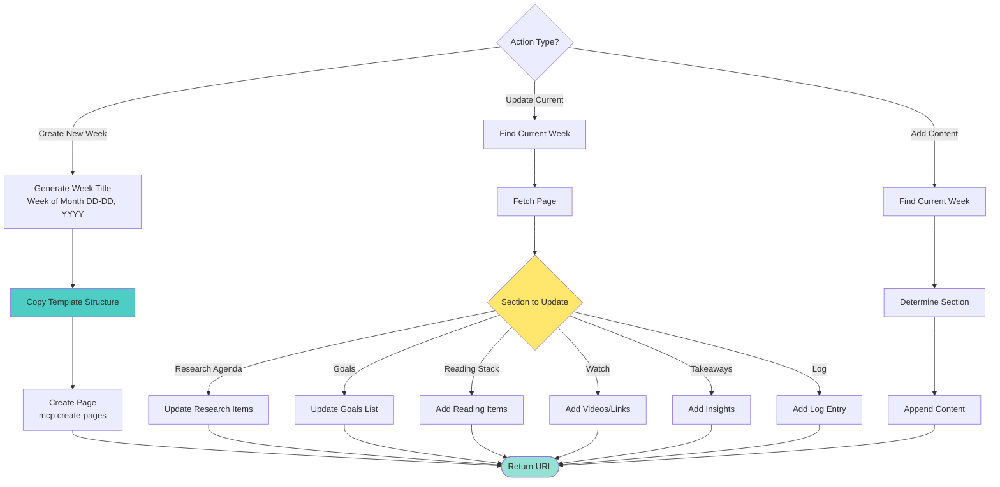

<!-- Notion Links (update here if URLs change) -->
<!-- Weekly Reports 2026 Parent: https://www.notion.so/2ef3caf373e08030a57afc948e20d7fb -->
<!-- Report Template: https://www.notion.so/mindamyers/Researching-TEMPLATE-3163caf373e0805884edc85dd48f3438 -->

# Managing Notion Weekly Reports

Create and update weekly report pages for tracking research, goals, reading, and takeaways.

## Prerequisites

**CRITICAL**: Notion MCP must be authenticated. Check with `claude mcp list`. If "⚠ Needs authentication", user must run `claude mcp`.

**Parent Page ID**: `2ef3caf373e08030a57afc948e20d7fb` (Weekly Reports: 2026)

## Workflow



## Create New Weekly Report

**Step 1: Generate Week Title**
- Format: "Week of [Month] [DD]-[DD], [YYYY]"
- Example: "Week of March 17-23, 2026"

**Step 2: Create Page with Template Structure**
```javascript
mcp__notion__notion-create-pages({
  parent: {page_id: "2ef3caf373e08030a57afc948e20d7fb"},
  pages: [{
    properties: {
      "title": "Week of [Month] [DD]-[DD], [YYYY]"
    },
    content: "<template-content>"  // See template structure below
  }]
})
```

**Step 3: Template Structure**
```markdown
<columns>
    <column>
        <callout icon="/icons/calendar-week_lightgray.svg" color="gray_bg">
            ### Research Agenda
            ---
            1.
        </callout>
    </column>
    <column>
        <callout icon="/icons/book_gray.svg" color="gray_bg">
            ## Pages
            ---
            …
        </callout>
    </column>
</columns>
<columns>
    <column>
        <callout icon="/icons/bullseye_gray.svg" color="gray_bg">
            ## Goals this Week
            ---
            1.
        </callout>
        …
    </column>
    <column>
        <callout icon="/icons/book_gray.svg" color="gray_bg">
            ## Reading Stack
            ---
            …
        </callout>
        <callout icon="/icons/preview_gray.svg" color="gray_bg">
            ## Watch
            ---
            …
        </callout>
    </column>
    <column>
        <callout icon="/icons/new-badge_gray.svg" color="gray_bg">
            ## Takeaways
            ---
            …
        </callout>
    </column>
</columns>
# Log
---
<callout icon="/icons/link_gray.svg" color="green">
    [url]
</callout>
```

## Find Current Week's Report

**Search for this week's report:**
```javascript
mcp__notion__notion-search({
  query: "Week of [current month and dates]",
  page_url: "2ef3caf373e08030a57afc948e20d7fb"
})
```

## Add Planning Section from Overlapping Projects

Automatically generate a planning section based on overlapping project priorities from Q1 Projects database.

**Workflow:**

1. **Identify Week Range** - Get current or specified week dates
2. **Query Active Projects** - Search Q1 Projects for overlapping timelines
3. **Extract Priorities** - Pull key tasks, deadlines, and focus areas
4. **Generate Simple List** - Create planning section with priorities

**Planning Section Format:**
```markdown
## Planning for Week of [Month DD-DD, YYYY]
---
**High Priority:**
- [ ] [Project]: [Specific task/deliverable]
- [ ] [Project]: [Next action]

**Medium Priority:**
- [ ] [Project]: [Task]

**Deadlines This Week:**
- [Date]: [Project milestone/deadline]

**Time Allocation:**
- [XX]% - [Primary project]
- [XX]% - [Secondary project]
- [XX]% - [Other tasks]

**Monday Morning Start:**
1. [First concrete action]
2. [Second action]
```

### Add Planning to Weekly Report

```javascript
// Step 1: Get overlapping projects
mcp__notion__notion-search({
  query: "status in progress project",
  page_size: 20
})

// Step 2: Filter for current week overlap
// (Projects with start <= week_end AND (end >= week_start OR no end))

// Step 3: Update weekly report with planning section
mcp__notion__notion-update-page({
  page_id: "<weekly-report-id>",
  command: "update_content",
  content_updates: [{
    old_str: "## Goals this Week\\n\\t\\t\\t---\\n\\t\\t\\t1.",
    new_str: "## Goals this Week\\n\\t\\t\\t---\\n\\t\\t\\t**From Project Priorities:**\\n\\t\\t\\t1. [Jobs] Submit 3-6 applications to frontier labs\\n\\t\\t\\t2. [BlueDot] Complete Session 3 prep and draft\\n\\t\\t\\t3. [Tanya] Send McAdams research notes\\n\\t\\t\\t\\n\\t\\t\\t**Time Allocation:**\\n\\t\\t\\t- 40% Job applications\\n\\t\\t\\t- 35% BlueDot project\\n\\t\\t\\t- 15% Tanya collaboration\\n\\t\\t\\t- 10% Admin/review"
  }]
})
```

## Update Sections

### Research Agenda
Add numbered research items:
```javascript
mcp__notion__notion-update-page({
  page_id: "<page-id>",
  command: "update_content",
  content_updates: [{
    old_str: "### Research Agenda\n\t\t\t---\n\t\t\t1.",
    new_str: "### Research Agenda\n\t\t\t---\n\t\t\t1. [Research item 1]\n\t\t\t2. [Research item 2]"
  }]
})
```

### Goals this Week
Update goals list:
```javascript
mcp__notion__notion-update-page({
  page_id: "<page-id>",
  command: "update_content",
  content_updates: [{
    old_str: "## Goals this Week\n\t\t\t---\n\t\t\t1.",
    new_str: "## Goals this Week\n\t\t\t---\n\t\t\t1. [Goal 1]\n\t\t\t2. [Goal 2]\n\t\t\t3. [Goal 3]"
  }]
})
```

### Reading Stack
Add articles/papers:
```javascript
mcp__notion__notion-update-page({
  page_id: "<page-id>",
  command: "update_content",
  content_updates: [{
    old_str: "## Reading Stack\n\t\t\t---\n\t\t\t…",
    new_str: "## Reading Stack\n\t\t\t---\n\t\t\t- [Article/Paper Title](link)\n\t\t\t- [Next item]"
  }]
})
```

### Log Section
Add timestamped entries:
```javascript
mcp__notion__notion-update-page({
  page_id: "<page-id>",
  command: "update_content",
  content_updates: [{
    old_str: "# Log\n<empty-block/>",
    new_str: "# Log\n\n**[Date/Time]** - [Log entry]\n\n"
  }]
})
```

## Common Operations

### Quick Add to Current Week
1. Search for current week's report
2. Fetch the page
3. Update specific section with new content

### Weekly Review
1. Fetch current week's report
2. Review all sections
3. Add final takeaways
4. Create next week's report

### Add Image to Log
```javascript
mcp__notion__notion-update-page({
  page_id: "<page-id>",
  command: "update_content",
  content_updates: [{
    old_str: "# Log\n",
    new_str: "# Log\n\n\n\n"
  }]
})
```

## Best Practices

1. **Create at week start** - Monday morning or Sunday evening
2. **Update daily** - Add to log and progress sections
3. **Review weekly** - Capture takeaways before creating next week
4. **Link related pages** - Use Pages section for context
5. **Track reading progress** - Mark items as complete
6. **Date log entries** - Include timestamps for reference
7. **Capture insights** - Don't wait, add takeaways as they occur

## Integration with Other Skills

**gtd**: Pulls overlapping project priorities for planning section - automatically identifies what needs attention this week

**notion-projects**: Queries Q1 Projects database for active project timelines and priorities

**fetching-notion-content**: Search and retrieve existing weekly reports

**notion-edits**: Complex content updates and formatting

**research-synthesis**: Add synthesis results to weekly report

**youtube-digesting-videos**: Add video links to Watch section

**download-url**: Add articles to Reading Stack

## Troubleshooting

**"Can't find this week's report"** → Check date format matches "Week of Month DD-DD, YYYY"

**"⚠ Needs authentication"** → Run `claude mcp`

**"Parent page not found"** → Verify Weekly Reports 2026 page exists

**"Template structure broken"** → Use exact callout and column structure from template

## Resources

- `references/weekly-template-structure.md` - Complete template markup
- `references/section-examples.md` - Example content for each section
- `references/notion-links.md` - All Notion URLs and IDs

## Related Skills

- **notion-projects** - Create project pages
- **notion-edits** - Update/modify Notion pages
- **fetching-notion-content** - Search/retrieve Notion content
- **gtd** - Planning and prioritization workflow