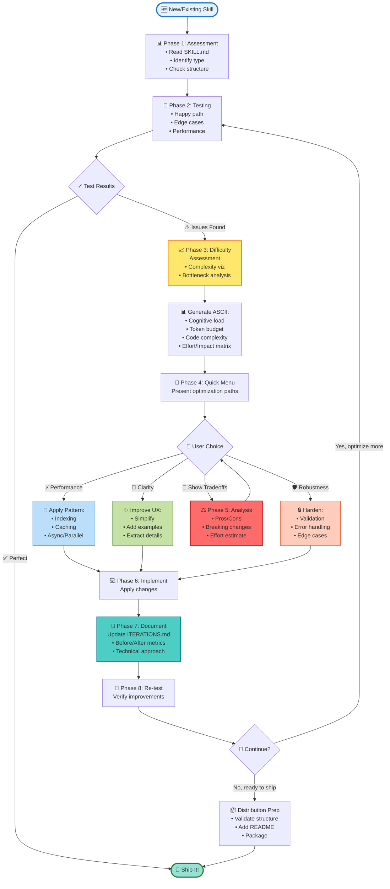

# Skill Optimization

Systematic framework for testing, refining, and optimizing Claude Code skills through iterative improvement.

## When to Use

- After creating a new skill (auto-invoked by skill-creator)
- When a skill feels slow or inefficient
- After real-world testing reveals issues
- When preparing for distribution

## Optimization Flow



## 8-Phase Process

**Phase 1: Assessment** - Read SKILL.md, identify type (search/transform/generate/analyze), check token count and folder structure

**Phase 2: Testing** - Guide user: happy path → edge cases → performance with real data. Observe time, errors, clarity, confusion

**Phase 3: Difficulty Assessment** - Generate ASCII viz of complexity (cognitive load, token budget, code complexity) + bottleneck analysis + effort/impact matrix

**Phase 4: Quick Menu** - Present optimization paths:
- **Performance**: faster queries, reduce I/O, parallel, smaller context
- **Clarity**: add Mermaid diagram, condense prose, better errors
- **Structure**: extract to `references/`, `scripts/`, `templates/`
- **Robustness**: edge cases, testing, logging, graceful degradation

**Phase 5: Pros/Cons Analysis** - When user requests tradeoffs: show benefits, costs, breaking changes, effort estimate, expected impact, recommendation

**Phase 6: Implementation** - Apply optimization patterns:
- Condensing: See `references/condensing-techniques.md`
- Mermaid diagrams: See `references/mermaid-best-practices.md`
- Subfolder organization: See `references/subfolder-structure.md`
- Performance: See `references/performance-patterns.md`

**Phase 7: Iteration Tracking** - Log in `templates/ITERATIONS.md` (changes, performance metrics, technical approach, breaking changes)

**Phase 8: Loop Back** - Re-test optimized skill, check for improvements/new issues, decide: continue optimizing, finalize, or more testing

## Optimization Decision Matrix

Use this matrix to prioritize optimization efforts based on effort and impact:

```mermaid
quadrantChart
    title Optimization Effort vs Impact
    x-axis Low Effort --> High Effort
    y-axis Low Impact --> High Impact
    quadrant-1 Strategic Investment
    quadrant-2 Quick Wins
    quadrant-3 Low Priority
    quadrant-4 Avoid (For Now)

    "Add examples": [0.2, 0.7]
    "Extract to refs/": [0.3, 0.6]
    "Improve errors": [0.3, 0.5]
    "Add caching": [0.4, 0.9]
    "SQLite indexing": [0.7, 0.95]
    "Rewrite in Rust": [0.95, 0.4]
    "Add logging": [0.2, 0.3]
    "Async/parallel": [0.6, 0.8]
    "Validate inputs": [0.3, 0.4]
    "Mermaid diagram": [0.25, 0.65]
```

**Reading the matrix:**
- **Quick Wins** (top-left): High impact, low effort → Do these first
- **Strategic Investment** (top-right): High impact, high effort → Plan carefully, worth doing
- **Low Priority** (bottom-left): Low impact, low effort → Only if time permits
- **Avoid** (bottom-right): Low impact, high effort → Skip unless required

## Pattern Selection Guide

Choose optimization patterns based on identified bottlenecks:

```mermaid
graph TD
    Bottleneck{What's the<br/>bottleneck?} -->|File operations<br/>Many files| FileOps[File I/O Patterns]
    Bottleneck -->|Computation<br/>Heavy processing| Compute[Compute Patterns]
    Bottleneck -->|Memory<br/>Large datasets| Memory[Memory Patterns]
    Bottleneck -->|Context<br/>Token usage| Context[Context Patterns]
    Bottleneck -->|UX<br/>User confusion| UX[Clarity Patterns]

    FileOps --> F1[🎯 File Walking?<br/>→ SQLite Index<br/>⚡ 50-200x faster]
    FileOps --> F2[🎯 Repeated Reads?<br/>→ Cache Layer<br/>⚡ 10-100x faster]
    FileOps --> F3[🎯 Large Files?<br/>→ Streaming/Tail<br/>⚡ 10-50x faster]

    Compute --> C1[🎯 Sequential Ops?<br/>→ Async/Parallel<br/>⚡ 3-10x faster]
    Compute --> C2[🎯 Repeated Calc?<br/>→ Memoization<br/>⚡ 10-100x faster]

    Memory --> M1[🎯 Loading All?<br/>→ Streaming<br/>💾 90%+ reduction]
    Memory --> M2[🎯 Full Parsing?<br/>→ Targeted Extract<br/>💾 5-20x smaller]

    Context --> T1[🎯 Large SKILL.md?<br/>→ Extract to refs/<br/>📉 2-5x reduction]
    Context --> T2[🎯 Verbose?<br/>→ Bullet points<br/>📉 30-50% reduction]
    Context --> T3[🎯 Complex flow?<br/>→ Mermaid diagram<br/>✨ Clarity boost]

    UX --> U1[🎯 Confusing steps?<br/>→ Add examples<br/>✨ Better UX]
    UX --> U2[🎯 Poor errors?<br/>→ Improve messages<br/>✨ Easier debug]
    UX --> U3[🎯 No structure?<br/>→ Organize subfolders<br/>✨ Better nav]

    style FileOps fill:#bbdefb,stroke:#1976d2,stroke-width:2px
    style Compute fill:#c5e1a5,stroke:#558b2f,stroke-width:2px
    style Memory fill:#ffccbc,stroke:#d84315,stroke-width:2px
    style Context fill:#f8bbd0,stroke:#c2185b,stroke-width:2px
    style UX fill:#ffe082,stroke:#f57c00,stroke-width:2px

    style F1 fill:#e3f2fd
    style F2 fill:#e3f2fd
    style F3 fill:#e3f2fd
    style C1 fill:#f1f8e9
    style C2 fill:#f1f8e9
    style M1 fill:#fbe9e7
    style M2 fill:#fbe9e7
    style T1 fill:#fce4ec
    style T2 fill:#fce4ec
    style T3 fill:#fce4ec
    style U1 fill:#fff8e1
    style U2 fill:#fff8e1
    style U3 fill:#fff8e1
```



## Common Performance Patterns

| Bottleneck | Solution | Expected Gain |
|------------|----------|---------------|
| File walking | SQLite/JSON index | 50-200x |
| Repeated reads | Caching layer | 10-100x |
| Large files | Streaming/tail read | 10-50x |
| Sequential ops | Async/parallel | 3-10x |
| Repeated compute | Memoization | 10-100x |

See `references/performance-patterns.md` for detailed examples.

## Visualization Templates

**Complexity Assessment:**
```
Optimization Assessment: [skill-name]
━━━━━━━━━━━━━━━━━━━━━━━━━━━━━━━━━━━━━━━━

Current Complexity: [Low/Medium/High]
Cognitive Load: ████████░░ (80%)
Token Budget: ██████░░░░ (60%)
Code Complexity: ███░░░░░░░ (30%)

Optimization Opportunities:
  Performance     ████████ 🔴 Critical
  Clarity         ███████░ 🟡 Recommended
  Error Handling  ████░░░░ 🟢 Nice-to-have

Bottleneck Analysis:
  File I/O         ████████
  Computation      ███░░░░░
  Context Size     ██░░░░░░
```

**Performance Evolution:**
```
Performance Evolution: [skill-name]
━━━━━━━━━━━━━━━━━━━━━━━━━━━━━━━━━━━━━━━━

Query Performance:
v1.0: ████████████████████████████████████████ 15.0s
v1.1: ████████████████████                      6.5s
v2.0: █ 0.1s ⚡ GOAL REACHED

Token Budget:
v1.0: ████████████████ 8,000 tokens
v2.0: ███              1,500 tokens
```

## Benchmarking

```bash
python .claude/skills/skill-optimization/scripts/benchmark_skill.py \
  --skill-path .claude/skills/your-skill \
  --test-data path/to/realistic/data
```

Outputs: execution time (p50/p95/p99), memory (current/peak), tokens, comparison to previous runs

## Optimization Best Practices

### Token Reduction
- **Target**: <1,000 words (<1,500 tokens) for SKILL.md
- **Progressive disclosure**: Move details to `references/`
- **Bullet points over prose**: Scannable lists beat paragraphs
- **Tables for comparisons**: Quick reference format
- **Extract examples**: Keep 1-2 inline, rest in references

See `references/condensing-techniques.md` for detailed strategies.

### Mermaid Diagrams
- **Show decisions**, not just linear flow
- **Match structure** to skill type (hub-and-spoke, iterative, parallel)
- **Multi-line labels**: Add context with `<br/>`
- **Color grouping**: Visual landmarks with `style` directive
- **Start with user intent**, not implementation
- **Happy path only**: 80% use case, not every edge case

See `references/mermaid-best-practices.md` for complete guide.

### Subfolder Organization
- **references/**: Detailed docs, examples, troubleshooting
- **scripts/**: Executable Python/shell tools
- **templates/**: Reusable file templates
- **examples/** (optional): Complex real-world scenarios

See `references/subfolder-structure.md` for when to create each.

## Completion Criteria

✓ SKILL.md <1,000 words (<1,500 tokens)
✓ Mermaid diagram showing decision flow
✓ Content organized in subfolders
✓ Resources section lists all references
✓ Passes all tests (happy + edge)
✓ Performance meets expectations
✓ Clear, actionable errors
✓ Current `templates/ITERATIONS.md`

## Anti-Patterns

**Don't:** Optimize before realistic testing · Add complexity without measuring · Break compatibility without strong reason · Optimize hypothetical futures · Skip documentation

**Do:** Test first, optimize bottlenecks · Measure before/after · Start simple · Document tradeoffs · Keep iteration history · Validate with real usage

## Resources

### Core Optimization Guides
- `references/condensing-techniques.md` - Token reduction strategies
- `references/mermaid-best-practices.md` - Diagram creation guide
- `references/subfolder-structure.md` - Content organization patterns
- `references/performance-patterns.md` - Speed optimization techniques

### Testing & Quality
- `references/testing-guide.md` - Testing strategies
- `references/optimization-checklist.md` - Step-by-step checklist
- `scripts/benchmark_skill.py` - Performance benchmarking

### Templates
- `templates/ITERATIONS.md` - Optimization history tracking

---

**Goal:** Make skills better for actual users based on real usage and real bottlenecks, not theoretical perfection.
