# Mermaid Diagram Best Practices for Skills

How to create effective Mermaid diagrams that improve comprehension and reduce token count.

## Core Principle

**Mermaid diagrams are cognitive shortcuts, not documentation.**

They should answer: "What are the main paths through this skill?" not "What does every line of code do?"

**The 10-second test**: Can someone look at the diagram and understand when to use this skill and what the major decision points are?

## 7 Best Practices

### 1. Show Decision Points, Not Just Flow

**Bad** (linear flow tells you nothing):
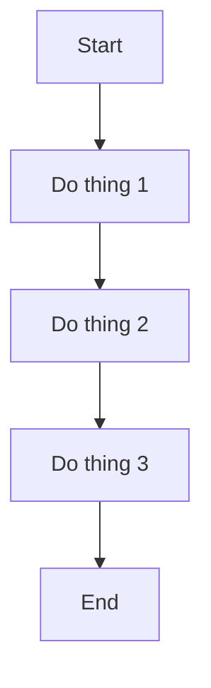

**Good** (decisions show the real logic):
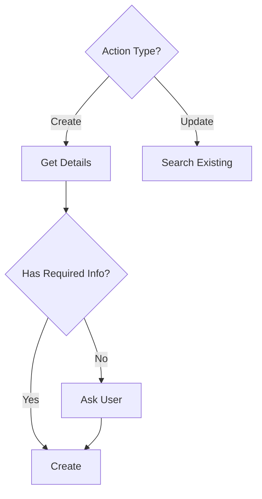

**Key insight**: Use diamond `{...}` nodes for decisions, show what determines the path.

### 2. Match Diagram Type to Skill Structure

**Hub-and-spoke** (independent operations):
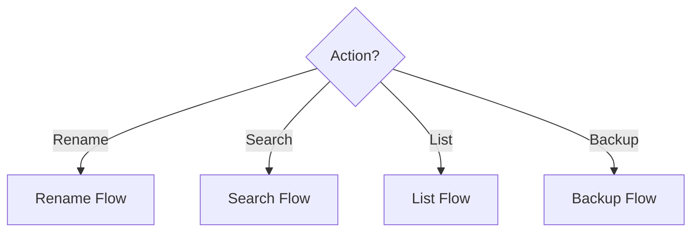
*Use for*: Skills with multiple independent operations (e.g., conversations-manage)

**Linear with branches** (sequential with alternatives):
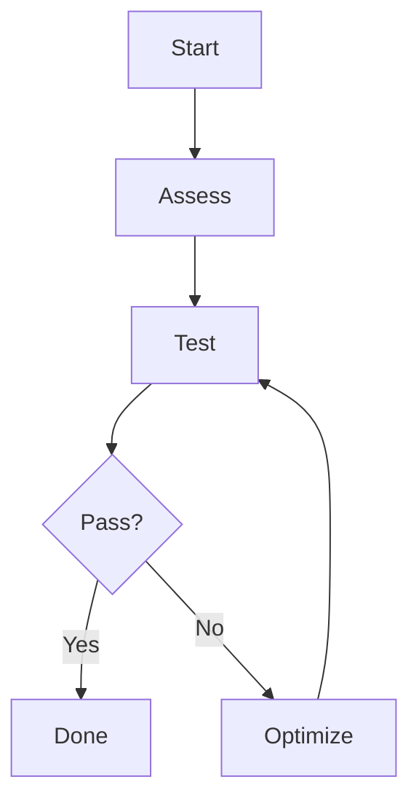
*Use for*: Skills with iterative workflows (e.g., skill-optimization)

**Parallel paths** (different starting points):
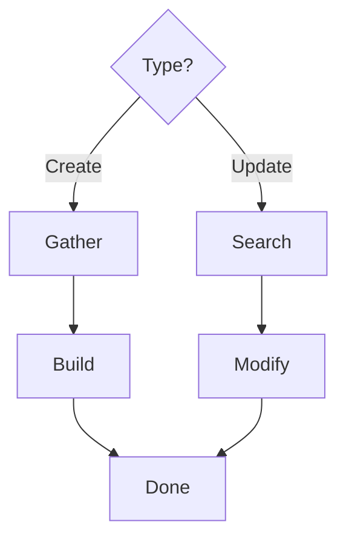
*Use for*: Skills with distinct workflows that don't interact (e.g., notion-projects)

### 3. Use Multi-line Labels for Context

**Bad** (just action names):
```mermaid
S1[Generate] --> S2[Show] --> S3[Ask]
```

**Good** (what + how):
```mermaid
S1[Analyze Conversation<br/>Actions/Files/Tech] --> S2[Generate 4 Titles<br/>Action-based/Context-aware] --> S3[AskUserQuestion]
```

Use `<br/>` to add context without making nodes too wide.

### 4. Group Related Operations with Color

Use `style` directive to create visual landmarks:

```mermaid
graph TD
    Start --> Analysis[Analyze]
    Analysis --> Decision{Choose}
    Decision --> Action1[Process]
    Decision --> Action2[Transform]
    Action1 --> Done([Complete])
    Action2 --> Done

    style Analysis fill:#ffe66d    # Analysis/thinking (yellow)
    style Decision fill:#ff6b6b     # Critical decision (red)
    style Done fill:#95e1d3         # Success state (green)
```

**Color vocabulary:**
- `#ffe66d` (yellow) - Analysis, assessment, thinking
- `#ff6b6b` (red) - Critical decisions, warnings
- `#4ecdc4` (teal) - Actions, implementations
- `#95e1d3` (green) - Success, completion
- `#a8e6cf` (light green) - Secondary success

### 5. Start with User Intent, Not Implementation

**Bad** (implementation-focused):
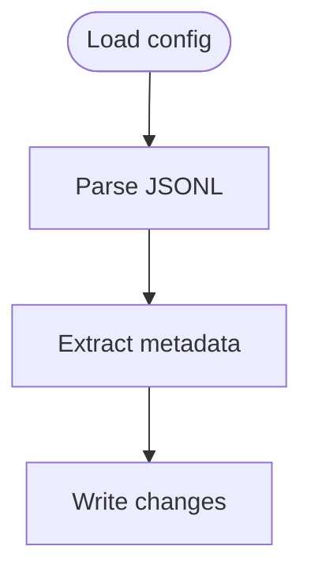

**Good** (user-focused):
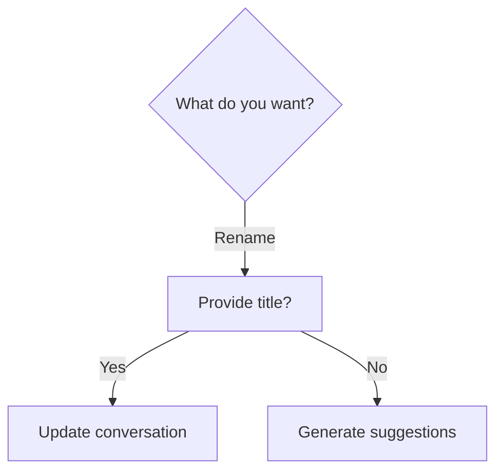

Users don't think "I want to parse JSONL" - they think "I want to rename this conversation."

### 6. Show Happy Path Only (80% Use Case)

**Don't include:**
- Error handling ("File not found")
- Edge cases ("Malformed JSON")
- Validation steps ("Check permissions")
- Implementation details ("Initialize cache")

**These belong in:**
- "Common Fail Modes" section
- "Error Handling" section
- Implementation reference docs

**Example** - conversations-manage showed 6 operations but not:
- What if file doesn't exist?
- What if JSONL is malformed?
- What if user doesn't have permissions?

Those are documented in text, not the diagram.

### 7. Use Meaningful Node Shapes

**Node shape vocabulary:**
- `[]` Rectangle = Process/action ("Create page", "Search files")
- `{}` Diamond = Decision point ("Action type?", "Has info?")
- `()` Rounded = Start/end states ("New skill", "Complete")
- `[()]` Stadium = Sub-process/grouped actions ("Optimization phase")

```mermaid
graph TD
    Start([User Request])           %% Entry point
    Start --> Type{Choose action}    %% Decision
    Type -->|A| P1[Process A]        %% Action
    Type -->|B| P2[Process B]        %% Action
    P1 --> Done([Success])           %% Exit point
    P2 --> Done
```

## Common Patterns

### Pattern: Create vs Update

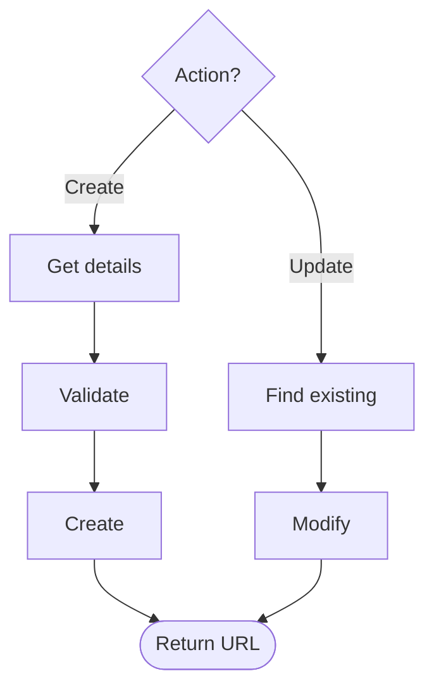

### Pattern: Iterative Improvement

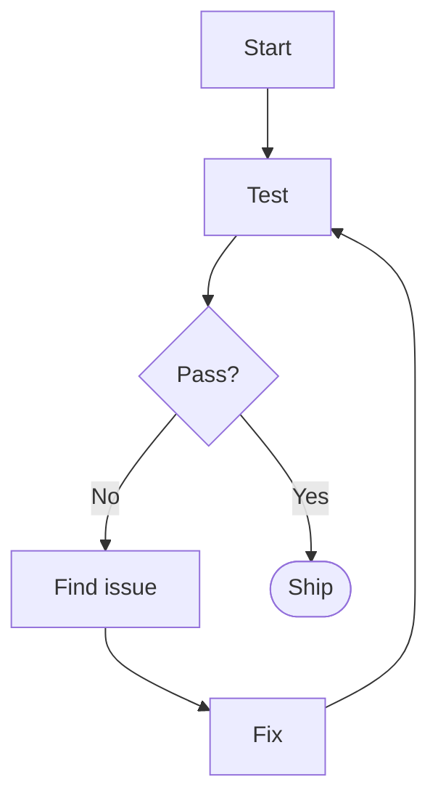

### Pattern: Multi-Agent Workflow

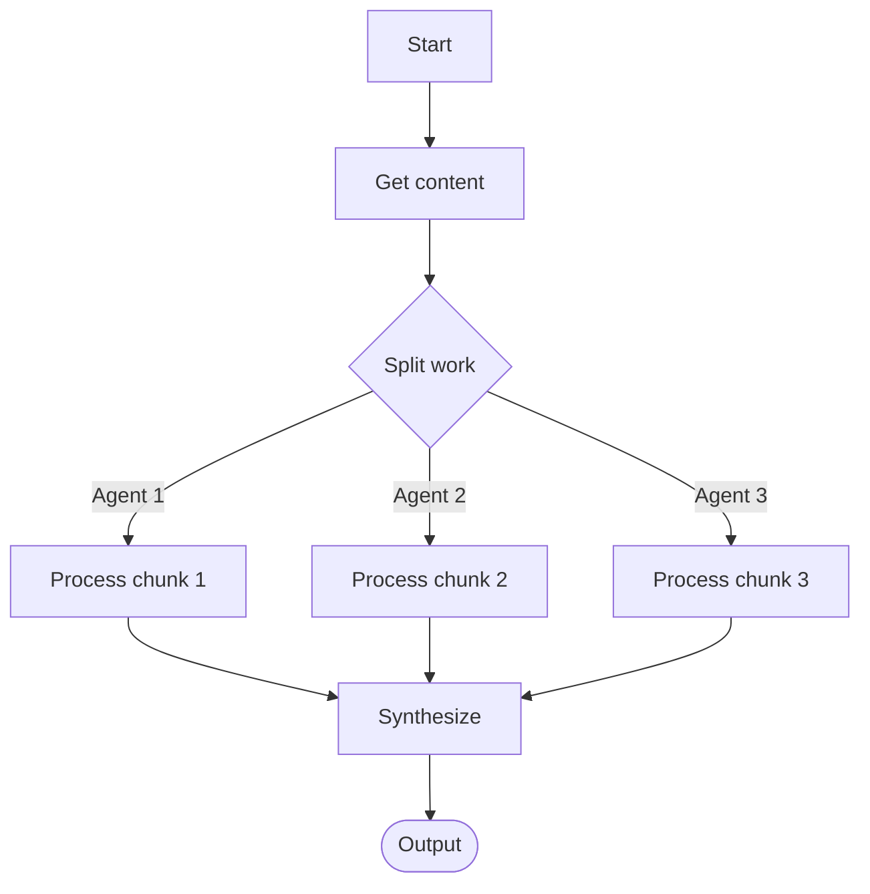

## Optimization Impact

Adding effective Mermaid diagrams typically enables:
- **30-50% reduction** in prose explanations
- **Faster comprehension** (10-second scan vs reading paragraphs)
- **Better mental models** (visual structure aids recall)
- **Reduced support questions** (users see the flow immediately)

## Template

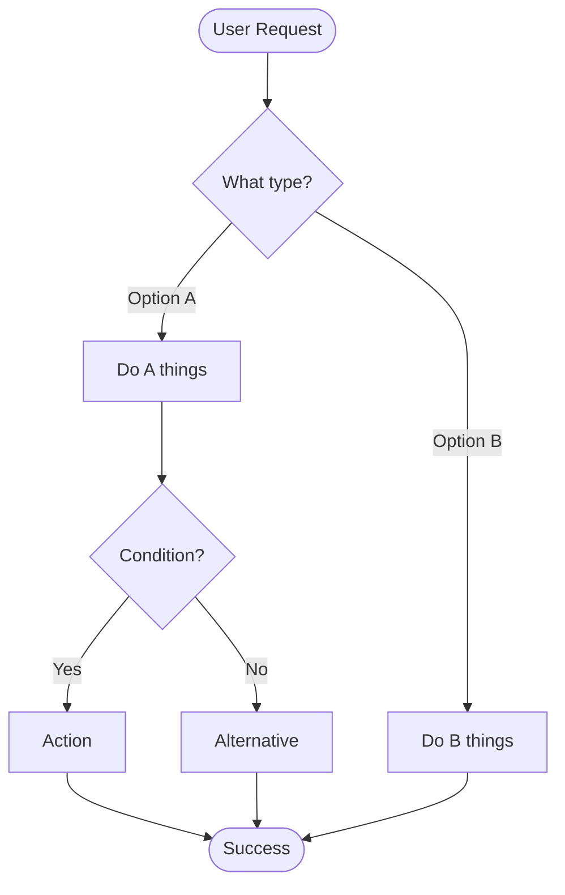

## Anti-Patterns

**Don't:**
- Show every error case and validation step
- Make diagrams that require scrolling to understand
- Use generic labels like "Process data" or "Do work"
- Include implementation details like "Initialize cache"
- Create diagrams that duplicate what's already clear in text

**Do:**
- Focus on user decisions and major paths
- Keep diagrams scannable in <10 seconds
- Use specific labels with context ("Generate 4 Titles")
- Show the conceptual flow, not code execution
- Use diagrams to replace verbose prose explanations

## When to Skip Diagrams

Not every skill needs a Mermaid diagram:

**Skip if:**
- Skill is a simple linear process (do A, then B, then C)
- Skill has only one operation with no decisions
- Text explanation is already <200 words and clear
- Skill is a wrapper around a single tool

**Example**: A skill that just "fetch URL, save to markdown" doesn't need a diagram.

## Measuring Success

A good Mermaid diagram:
1. ✓ Shows decision points clearly
2. ✓ Uses appropriate colors for grouping
3. ✓ Has specific, contextual labels
4. ✓ Fits in one screen view
5. ✓ Starts with user intent
6. ✓ Passes the 10-second comprehension test
7. ✓ Enables removing 100+ words of prose explanation

Test: Show someone the diagram. Can they explain when to use the skill and what the main paths are?
