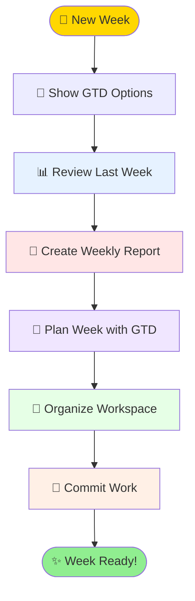

# Weekly Setup Orchestration

Complete workflow for setting up a new week with visual progress indicators.

## Prerequisites

- Notion MCP authenticated (`claude mcp list`)
- Access to weekly reports folder
- Other skills available: notion-weekly-reports, gtd, learning, saving-memories

## Quick Start - GTD Commands

When starting your week, these commands are available:

```bash
# Show GTD options
python3 .claude/skills/gtd/gtd_options.py
```

## Main Workflow



## Visual Progress Display

```
╔════════════════════════════════════════════════╗
║           🌟 WEEKLY SETUP WIZARD 🌟            ║
╠════════════════════════════════════════════════╣
║                                                ║
║  [✓] Review Last Week         ████████ 100%   ║
║  [✓] Create Weekly Report      ████████ 100%   ║
║  [⏳] Plan with GTD             ████░░░░  50%   ║
║  [ ] Organize Workspace        ░░░░░░░░   0%   ║
║  [ ] Commit Pending Work       ░░░░░░░░   0%   ║
║                                                ║
║         Overall Progress: 50% Complete         ║
║                ████████████░░░░░░░░░           ║
╚════════════════════════════════════════════════╝
```

## Step-by-Step Process

### Step 0: Display GTD Options 🎯

```
╔═══════════════════════════════════════════════╗
║  🎯 GTD QUICK COMMANDS                        ║
╠═══════════════════════════════════════════════╣
║  /gtd visualize      → Current focus & next   ║
║  /gtd visualize-week → Weekly plan & capacity ║
║  /gtd tradeoffs      → Allocation options     ║
║  "let's plan my week/day" → Interactive plan  ║
╚═══════════════════════════════════════════════╝
```

**Implementation:**
```javascript
// Display GTD options at startup
Bash({
  command: "python3 .claude/skills/gtd/gtd_options.py"
})
```

### Step 1: Review Last Week 📊

```
┌─────────────────────────────────────┐
│  📊 REVIEWING LAST WEEK...          │
│  ▔▔▔▔▔▔▔▔▔▔▔▔▔▔▔▔▔▔▔▔▔            │
│  ➤ Finding last week's report       │
│  ➤ Extracting takeaways            │
│  ➤ Checking incomplete goals       │
│  ➤ Noting carryover items          │
└─────────────────────────────────────┘
```

**Actions:**
1. Search for last week's report
2. Fetch takeaways and incomplete items
3. Create carryover list
4. Save important learnings

**Implementation:**
```javascript
// Search for last week's report
mcp__notion__notion-search({
  query: "Week of [last week dates]",
  page_url: "2ef3caf373e08030a57afc948e20d7fb"
})

// Fetch and analyze
mcp__notion__notion-fetch({
  id: "[last-week-page-id]"
})
```

**Success Visual:**
```
✅ Last Week Review Complete!
   ├─ 3 takeaways captured
   ├─ 2 goals carried forward
   └─ 5 items completed
```

### Step 2: Create Weekly Report 📝

```
┌─────────────────────────────────────┐
│  📝 CREATING WEEKLY REPORT...       │
│  ▔▔▔▔▔▔▔▔▔▔▔▔▔▔▔▔▔▔▔▔▔            │
│  ➤ Generating week title           │
│  ➤ Copying template structure      │
│  ➤ Adding carryover items         │
│  ➤ Creating Notion page           │
└─────────────────────────────────────┘
```

**Actions:**
1. Calculate current week dates
2. Use notion-weekly-reports skill
3. Add carryover items from last week
4. Return new report URL

**Implementation:**
```javascript
Skill({
  command: "notion-weekly-reports"
})
// The skill handles report creation
```

**Success Visual:**
```
✅ Weekly Report Created!
   📄 Week of March 17-23, 2026
   🔗 https://notion.so/[new-report-id]
   └─ Template applied with carryover items
```

### Step 3: Plan Week with GTD 🎯

```
┌─────────────────────────────────────┐
│  🎯 PLANNING YOUR WEEK...          │
│  ▔▔▔▔▔▔▔▔▔▔▔▔▔▔▔▔▔▔▔▔            │
│  ➤ Loading GTD framework           │
│  ➤ Setting weekly priorities       │
│  ➤ Allocating time blocks         │
│  ➤ Identifying key decisions      │
└─────────────────────────────────────┘
```

**Actions:**
1. Run GTD skill for weekly planning
2. Set 3-5 key priorities
3. Create time allocation
4. Update weekly report with goals

**Implementation:**
```javascript
Skill({
  command: "gtd"
})
// Interactive planning session
```

**Success Visual:**
```
✅ Week Planned!
   🎯 Top Priorities:
      1. Complete project X
      2. Review research papers
      3. Prepare for meeting Y

   ⏰ Time Allocated:
      Deep Work: 20 hrs
      Meetings: 8 hrs
      Admin: 4 hrs
```

### Step 4: Organize Workspace 📂

```
┌─────────────────────────────────────┐
│  📂 ORGANIZING WORKSPACE...        │
│  ▔▔▔▔▔▔▔▔▔▔▔▔▔▔▔▔▔▔▔▔           │
│  ➤ Clearing old drafts            │
│  ➤ Archiving completed items      │
│  ➤ Updating project statuses      │
│  ➤ Refreshing todo lists         │
└─────────────────────────────────────┘
```

**Actions:**
1. Archive old drafts
2. Update project statuses
3. Clear completed todos
4. Organize downloads folder

**Success Visual:**
```
✅ Workspace Organized!
   📁 Files organized
   ✓ 12 old drafts archived
   ✓ 8 projects status updated
   ✓ Todo list refreshed
```

### Step 5: Commit Pending Work 💾

```
┌─────────────────────────────────────┐
│  💾 COMMITTING WORK...             │
│  ▔▔▔▔▔▔▔▔▔▔▔▔▔▔▔▔▔▔             │
│  ➤ Checking git status            │
│  ➤ Committing changes             │
│  ➤ Pushing to repositories       │
│  ➤ Creating backup               │
└─────────────────────────────────────┘
```

**Actions:**
1. Run committing-work skill
2. Push to both personal and public repos
3. Create weekly backup

**Implementation:**
```javascript
Skill({
  command: "committing-work"
})
```

**Success Visual:**
```
✅ Work Committed!
   📦 2 repositories updated
   ✓ Personal repo: 5 files
   ✓ Public repo: 3 files
   💾 Backup created
```

## Final Summary Display

```
╔══════════════════════════════════════════════════╗
║                                                  ║
║            ✨ WEEK SETUP COMPLETE! ✨            ║
║                                                  ║
╠══════════════════════════════════════════════════╣
║                                                  ║
║  Weekly Report:   ✅ Created                     ║
║  Planning:        ✅ 3 priorities set            ║
║  Organization:    ✅ Workspace cleaned            ║
║  Commits:         ✅ All changes saved            ║
║  Carryover:       ✅ 2 items transferred         ║
║                                                  ║
║  ┌────────────────────────────────────┐         ║
║  │  🎯 This Week's Focus:             │         ║
║  │  1. Complete AI safety research    │         ║
║  │  2. Job application deadlines      │         ║
║  │  3. Learning Rust async patterns   │         ║
║  └────────────────────────────────────┘         ║
║                                                  ║
║  📅 Week of March 17-23, 2026                    ║
║  🔗 Report: notion.so/32c3caf373e0818d           ║
║                                                  ║
║         Have a productive week! 🚀               ║
║                                                  ║
╚══════════════════════════════════════════════════╝
```

## Quick Commands

### Minimal Setup (Just Report)
```
"quick week" - Creates report only
```

### Full Setup
```
"new week" - Complete workflow
```

### Review Only
```
"week review" - Just review last week
```

## Error Handling

### Missing Last Week
```
⚠️ No report found for last week
   → Creating fresh start for this week
```

### Notion Not Authenticated
```
❌ Notion not connected
   → Please run: claude mcp
```

### Incomplete Setup
```
⚠️ Setup interrupted at: Planning
   → Run "continue week setup" to resume
```

## Integration Points

**Skills Used:**
- notion-weekly-reports
- gtd
- learning
- committing-work
- saving-memories

**Data Flow:**
1. Last week → Carryover items
2. Carryover → New report
3. Planning → Goals section
4. Organization → Clean state
5. Commits → Saved progress

## Best Practices

1. **Run Monday morning** - Start week fresh
2. **Review first** - Learn from last week
3. **Plan realistically** - 3-5 priorities max
4. **Commit regularly** - Don't lose work
5. **Update daily** - Keep report current

## Customization

Users can configure:
- Which steps to include
- Order of operations
- Automatic vs manual planning
- Commit preferences
- Archive locations

## Related Skills

- **notion-weekly-reports** - Report creation
- **gtd** - Planning framework
- **committing-work** - Git operations
- **wrapping-up** - End of day routine
- **saving-memories** - Preserve insights