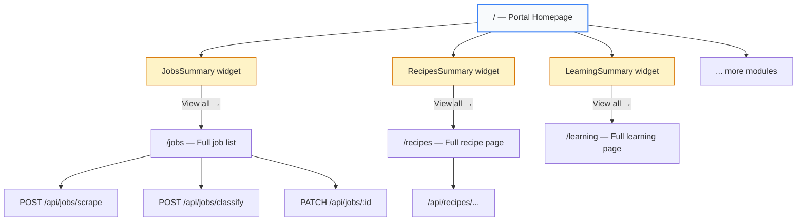
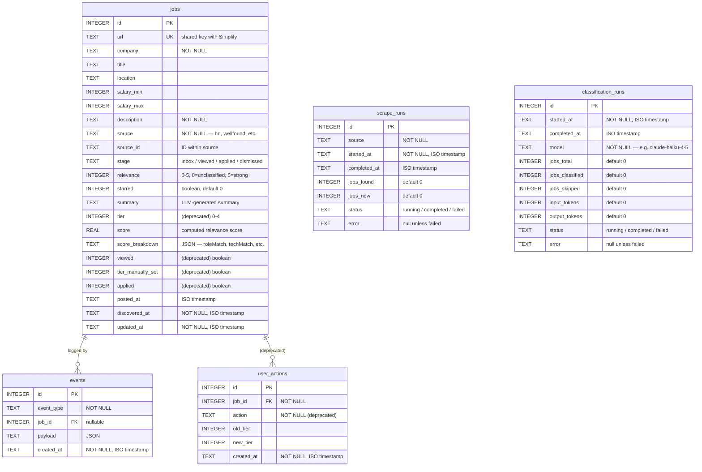

# Exobrain Web Portal

Next.js app serving as the multi-module dashboard for Exobrain. Each module (Jobs, Recipes, Learning, etc.) gets its own SQLite database, schema, and route group.

## Quick Start

```bash
cd app/web
pnpm install
pnpm db:push    # Create/migrate database tables
pnpm dev        # Starts at http://localhost:3000
```

## Stack

- **Next.js 16** — App Router, TypeScript, Turbopack
- **Tailwind CSS v4**
- **Drizzle ORM** + `@libsql/client` (SQLite, pure JS driver)
- **@dnd-kit** — drag-and-drop for Kanban board
- **Vercel AI SDK** (`ai` + `@ai-sdk/anthropic`) — structured LLM output via `generateObject()`
- **Zod v4** — schema validation for structured AI output
- **SQLite** — one file per module in `data/` (project root, gitignored)

## Portal Architecture

The homepage is a **dashboard of dashboards**. Each module exports a compact summary widget that renders on the portal homepage, plus a full page at its own route.



## Database Design

### One SQLite file per module

Each module gets its own isolated database file in `data/` (project root, gitignored):

```
data/
├── jobs.db        # Jobs module
├── recipes.db     # Recipes module (future)
├── learning.db    # Learning module (future)
└── ...
```

**Why separate files instead of one shared database:**
- **Independence** — delete, back up, or reset one module without touching others
- **No schema collisions** — modules can use generic table names (`items`, `tags`) without conflict
- **Simpler migrations** — each module migrates its own DB independently
- **Portable** — copy a single `.db` file to move a module's data elsewhere

The `createModuleDB(moduleName, schema)` factory in `src/lib/db.ts` handles this. It creates a Drizzle client backed by `data/{moduleName}.db`, caches clients per module per process, and resolves paths via the `DATA_DIR` env var (defaults to `../../data` from `app/web/`).

### Schema conventions

All modules should follow these conventions:

- **Autoincrement integer IDs** — `integer("id").primaryKey({ autoIncrement: true })`
- **Dates as ISO text** — `text("created_at")` storing ISO 8601 strings, not Date objects
- **Booleans as integers** — `integer("viewed").default(0)` using 0/1 (SQLite has no boolean type)
- **JSON as text** — `text("score_breakdown")` storing stringified JSON
- **Snake case columns** — `source_id`, `posted_at` (Drizzle maps camelCase properties to snake_case columns)
- **Dedup via source + source_id** — for data ingested from external sources

### Jobs Schema (`data/jobs.db`)



**Pipeline stages:** `inbox` → `viewed` → `applied` (or `dismissed`). Jobs also appear in a computed "Stale" column if they've been in inbox >5 days.

**Relevance levels:** 0 = unclassified, 1 = poor match, 2 = weak, 3 = moderate, 4 = good, 5 = strong match. Levels 4-5 are expanded by default in the Kanban Inbox column.

**Event types:** `stage_changed`, `relevance_corrected`, `job_viewed`, `job_starred`, `job_dismissed`

**Dedup:** `source` + `source_id`. Re-scrapes update `description` and `updated_at` on existing rows.

**Deprecated columns:** `tier`, `viewed`, `applied`, `tier_manually_set` remain in the schema but are superseded by `stage`, `relevance`, and the `events` table.

## Project Structure

```
app/web/
├── drizzle.config.ts
├── src/
│   ├── lib/
│   │   └── db.ts                         # createModuleDB() factory
│   ├── app/
│   │   ├── layout.tsx                    # Portal shell
│   │   ├── page.tsx                      # Homepage — dashboard of dashboards
│   │   ├── (jobs)/jobs/                  # Jobs module pages
│   │   │   ├── page.tsx                  # /jobs — server component orchestrator
│   │   │   ├── kanban-board.tsx          # Kanban board with DnD (client)
│   │   │   ├── kanban-column.tsx         # Droppable column (client)
│   │   │   ├── kanban-card.tsx           # Draggable job card (client)
│   │   │   ├── relevance-section.tsx     # Collapsible subsection per column (client)
│   │   │   ├── job-detail-panel.tsx      # Slide-out detail panel (client)
│   │   │   ├── classify-button.tsx       # Classify trigger (client)
│   │   │   └── scrape-button.tsx         # Scrape trigger (client)
│   │   └── api/jobs/
│   │       ├── scrape/route.ts           # POST /api/jobs/scrape
│   │       ├── classify/route.ts         # POST /api/jobs/classify
│   │       ├── [id]/route.ts             # PATCH /api/jobs/:id
│   │       └── events/route.ts           # POST /api/jobs/events
│   └── modules/
│       └── jobs/
│           ├── schema.ts                 # Drizzle schema (jobs, scrape_runs, events, classification_runs)
│           ├── db.ts                     # Module DB client
│           ├── classifier.ts             # LLM classification pipeline (Haiku + AI SDK)
│           ├── summary.tsx               # Dashboard widget
│           └── scrapers/
│               └── hn.ts                 # HN scraper
└── data/                                 # (at project root, gitignored)
    └── jobs.db
```

## Adding a New Module

Use Jobs as the reference implementation. Here's the checklist for adding e.g. a "Recipes" module:

### 1. Schema + DB client

Create `src/modules/recipes/schema.ts`:

```typescript
import { sqliteTable, text, integer } from "drizzle-orm/sqlite-core";
import { type InferSelectModel, type InferInsertModel } from "drizzle-orm";

export const recipes = sqliteTable("recipes", {
  id: integer("id").primaryKey({ autoIncrement: true }),
  title: text("title").notNull(),
  // ... your columns, following conventions above
  createdAt: text("created_at").notNull(),
  updatedAt: text("updated_at").notNull(),
});

export type Recipe = InferSelectModel<typeof recipes>;
export type NewRecipe = InferInsertModel<typeof recipes>;
```

Create `src/modules/recipes/db.ts`:

```typescript
import { createModuleDB } from "@/lib/db";
import * as schema from "./schema";

export const db = createModuleDB("recipes", schema);
```

### 2. Push the schema

Add the module's schema to `drizzle.config.ts` or create a separate config, then:

```bash
pnpm db:push
```

This creates `data/recipes.db` with your tables.

### 3. Summary widget (homepage card)

Create `src/modules/recipes/summary.tsx` — an async server component:

```typescript
import { db } from "@/modules/recipes/db";
import { recipes } from "@/modules/recipes/schema";
import Link from "next/link";

export async function RecipesSummary() {
  // Query for stats and top items
  // Return a compact card with a "View all →" link
  return (
    <div className="rounded-lg border border-zinc-200 bg-white p-6">
      <h2 className="text-lg font-semibold text-zinc-900">Recipes</h2>
      {/* stats, top items */}
      <div className="mt-4 text-right">
        <Link href="/recipes" className="text-sm font-medium text-blue-600 hover:underline">
          View all recipes &rarr;
        </Link>
      </div>
    </div>
  );
}
```

### 4. Register on the portal homepage

Add the widget to `src/app/page.tsx`:

```typescript
import { RecipesSummary } from "@/modules/recipes/summary";

// Inside the grid:
<RecipesSummary />
```

### 5. Full module page

Create `src/app/(recipes)/recipes/page.tsx` — a server component with the full view. The route group `(recipes)` keeps URL clean as `/recipes`.

### 6. API routes (if needed)

Create `src/app/api/recipes/` for any server actions.

### Summary

```
src/modules/{name}/schema.ts        # Drizzle schema (tables + types)
src/modules/{name}/db.ts            # createModuleDB("{name}", schema)
src/modules/{name}/summary.tsx      # Homepage dashboard widget
src/app/({name})/{name}/page.tsx    # Full module page at /{name}
src/app/api/{name}/                 # API routes
data/{name}.db                      # Isolated SQLite database (auto-created)
```

## API Endpoints

### `POST /api/jobs/scrape`

Triggers a full HN "Who is Hiring" scrape via Algolia API.

```json
// Success
{ "success": true, "threadTitle": "...", "jobsFound": 480, "jobsNew": 480, "jobsUpdated": 0 }

// Error
{ "success": false, "error": "..." }
```

### `POST /api/jobs/classify`

Triggers LLM classification of unclassified jobs using Claude Haiku. Reads user preferences from `config/job-profile.md` and recent user corrections as few-shot examples.

```json
// Request (all fields optional)
{ "batchSize": 50, "force": false }

// Success
{ "success": true, "runId": 3, "classified": 50, "remaining": 430, "model": "claude-haiku-4-5-20251001", "tokensUsed": { "input": 48000, "output": 9500 } }

// Error
{ "success": false, "error": "Job profile not found at ..." }
```

### `PATCH /api/jobs/:id`

Update a job's stage, relevance, or starred status. Automatically logs events for each change.

```json
// Request (all fields optional)
{ "stage": "viewed", "relevance": 5, "starred": 1 }

// Response
{ "success": true, "job": { ... } }
```

Validations: `stage` must be `inbox | viewed | applied | dismissed`, `relevance` must be 0-5, `starred` must be 0 or 1.

### `POST /api/jobs/events`

Log a user interaction event.

```json
// Request
{ "eventType": "job_viewed", "jobId": 42, "payload": { "timeSpentSeconds": 12 } }

// Response
{ "success": true, "eventId": 7 }
```

## Roadmap

- **Phase 1** (done): Scaffold, HN scraper, basic job list, portal homepage
- **Phase 2** (done): Kanban board (4 columns), drag-and-drop, star/highlight, event logging, job detail panel, relevance 1-5 scale
- **Phase 3** (in progress): LLM classification pipeline (done), user profile (done), few-shot calibration (done). Remaining: more scrapers, email digest
- **Phase 4**: Embeddings, classifier training, pairwise ranking
- **Phase 5**: AI-assisted applications
