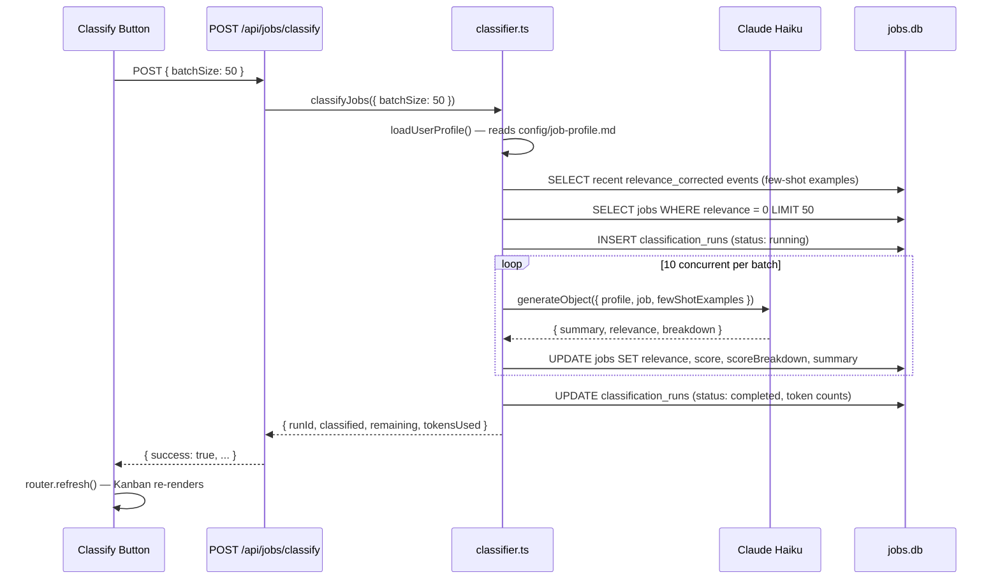
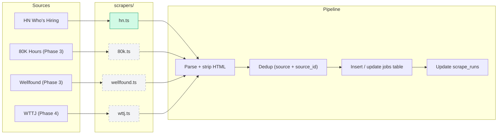
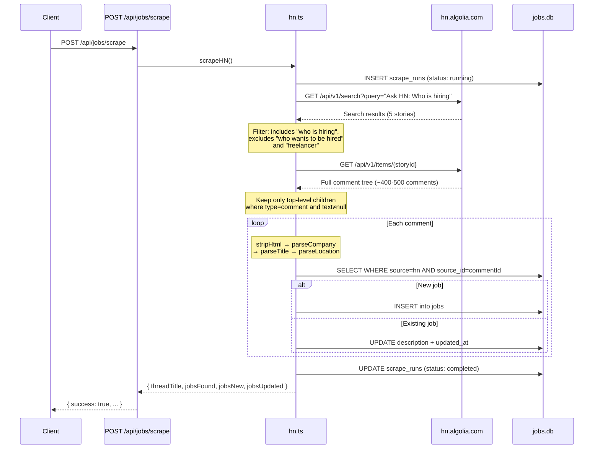

# Job Pipeline

Scrapes HN "Who is Hiring" threads, stores job listings in SQLite, and displays them in a Kanban board with drag-and-drop triage, relevance ranking, and behavioral event logging. First module in the Exobrain web portal.

## Architecture

```
src/
├── app/
│   ├── page.tsx                          # Portal homepage (imports JobsSummary widget)
│   ├── (jobs)/jobs/
│   │   ├── page.tsx                      # /jobs — server component orchestrator
│   │   ├── kanban-board.tsx              # Main board with DndContext (client)
│   │   ├── kanban-column.tsx             # Droppable column (client)
│   │   ├── kanban-card.tsx               # Draggable job card with star (client)
│   │   ├── relevance-section.tsx         # Collapsible subsection per column (client)
│   │   ├── job-detail-panel.tsx          # Slide-out detail panel (client)
│   │   ├── classify-button.tsx           # "Classify" trigger (client)
│   │   └── scrape-button.tsx             # "Scrape HN" trigger (client)
│   └── api/jobs/
│       ├── scrape/route.ts               # POST /api/jobs/scrape
│       ├── classify/route.ts             # POST /api/jobs/classify
│       ├── [id]/route.ts                 # PATCH /api/jobs/:id
│       └── events/route.ts               # POST /api/jobs/events
├── modules/jobs/
│   ├── schema.ts                         # Drizzle schema (jobs, scrape_runs, events, classification_runs)
│   ├── db.ts                             # Module DB client
│   ├── classifier.ts                     # LLM classification pipeline (Haiku + AI SDK)
│   ├── summary.tsx                       # Dashboard widget for portal homepage
│   └── scrapers/
│       └── hn.ts                         # HN Who's Hiring scraper (Algolia API)
└── lib/
    └── db.ts                             # createModuleDB() factory (shared across modules)
```

Data lives at `data/jobs.db` (project root, gitignored). Each module gets its own SQLite file via the `createModuleDB(moduleName, schema)` factory.

## Database Schema

Five tables in `data/jobs.db`:

### `jobs`

| Column             | Type    | Constraints              | Description                                        |
|--------------------|---------|-------------------------|----------------------------------------------------|
| `id`               | INTEGER | PK, autoincrement       | Internal ID                                        |
| `url`              | TEXT    | UNIQUE                  | Canonical URL — shared key with Simplify.jobs      |
| `title`            | TEXT    |                         | Job title (parsed from first-line pipe convention)  |
| `company`          | TEXT    | NOT NULL                | Company name (first segment of first line)          |
| `location`         | TEXT    |                         | Location/remote status (parsed from pipe segments)  |
| `salary_min`       | INTEGER |                         | Min salary (future use)                             |
| `salary_max`       | INTEGER |                         | Max salary (future use)                             |
| `description`      | TEXT    | NOT NULL                | Full posting text (HTML stripped)                    |
| `source`           | TEXT    | NOT NULL                | Source identifier, e.g. `"hn"`                      |
| `source_id`        | TEXT    |                         | ID within source (HN comment ID)                    |
| `stage`            | TEXT    | DEFAULT `"inbox"`       | Pipeline stage: `inbox`, `viewed`, `applied`, `dismissed` |
| `relevance`        | INTEGER | DEFAULT 0               | 0 = unclassified, 1 = perfect, 2 = good, 3 = distant match |
| `starred`          | INTEGER | DEFAULT 0               | Boolean (0/1) — user-flagged highlight              |
| `summary`          | TEXT    |                         | LLM-generated 2-3 sentence summary                  |
| `score`            | REAL    |                         | Computed relevance score (from classifier)           |
| `score_breakdown`  | TEXT    |                         | JSON breakdown: roleMatch, techMatch, locationFit, dealbreakers, reasoning |
| `tier`             | INTEGER | DEFAULT 0               | *(deprecated)* Superseded by `relevance`            |
| `viewed`           | INTEGER | DEFAULT 0               | *(deprecated)* Superseded by `stage`                |
| `tier_manually_set`| INTEGER | DEFAULT 0               | *(deprecated)* Superseded by events table           |
| `applied`          | INTEGER | DEFAULT 0               | *(deprecated)* Superseded by `stage`                |
| `posted_at`        | TEXT    |                         | ISO timestamp from source                           |
| `discovered_at`    | TEXT    | NOT NULL                | ISO timestamp when first scraped                    |
| `updated_at`       | TEXT    | NOT NULL                | ISO timestamp of last update                        |

**Pipeline stages:** `inbox` → `viewed` → `applied` (or `dismissed`). Jobs also appear in a computed "Stale" column if they've been in inbox >5 days.

**Relevance levels:** 0 = unclassified, 1 = perfect match, 2 = good match, 3 = distant match. Levels 1–2 are expanded by default in the Kanban Inbox column.

**Dedup key:** `source` + `source_id`. On re-scrape, existing jobs get their `description` and `updated_at` refreshed.

### `scrape_runs`

| Column        | Type    | Constraints        | Description                         |
|---------------|---------|--------------------|-------------------------------------|
| `id`          | INTEGER | PK, autoincrement  | Run ID                              |
| `source`      | TEXT    | NOT NULL           | Which scraper ran (`"hn"`)          |
| `started_at`  | TEXT    | NOT NULL           | ISO timestamp                       |
| `completed_at`| TEXT    |                    | ISO timestamp (null while running)  |
| `jobs_found`  | INTEGER | DEFAULT 0          | Total comments processed            |
| `jobs_new`    | INTEGER | DEFAULT 0          | New jobs inserted                   |
| `status`      | TEXT    | DEFAULT `"running"`| `running` → `completed` or `failed` |
| `error`       | TEXT    |                    | Error message if failed             |

### `events`

| Column       | Type    | Constraints             | Description                                    |
|--------------|---------|-------------------------|------------------------------------------------|
| `id`         | INTEGER | PK, autoincrement       | Event ID                                       |
| `event_type` | TEXT    | NOT NULL                | Event type (see below)                         |
| `job_id`     | INTEGER | FK → jobs.id, nullable  | Which job was acted on                         |
| `payload`    | TEXT    |                         | JSON string with event-specific details        |
| `created_at` | TEXT    | NOT NULL                | ISO timestamp                                  |

**Event types:**

| Event Type             | Trigger                               | Payload                                    |
|------------------------|---------------------------------------|--------------------------------------------|
| `stage_changed`        | Drag between columns or stage button  | `{ "fromStage": "inbox", "toStage": "viewed" }` |
| `relevance_corrected`  | Drag between relevance subsections    | `{ "oldRelevance": 0, "newRelevance": 5 }` |
| `job_viewed`           | Open job detail panel                 | `{}`                                       |
| `job_starred`          | Toggle star                           | `{ "starred": true }`                      |
| `job_dismissed`        | Dismiss from inbox                    | `{}`                                       |

### `classification_runs`

| Column             | Type    | Constraints        | Description                              |
|--------------------|---------|--------------------|------------------------------------------|
| `id`               | INTEGER | PK, autoincrement  | Run ID                                   |
| `started_at`       | TEXT    | NOT NULL           | ISO timestamp                            |
| `completed_at`     | TEXT    |                    | ISO timestamp (null while running)       |
| `model`            | TEXT    | NOT NULL           | Model used, e.g. `"claude-haiku-4-5-20251001"` |
| `jobs_total`       | INTEGER | DEFAULT 0          | Jobs attempted in this run               |
| `jobs_classified`  | INTEGER | DEFAULT 0          | Successfully classified                  |
| `jobs_skipped`     | INTEGER | DEFAULT 0          | Failed / skipped                         |
| `input_tokens`     | INTEGER | DEFAULT 0          | Total input tokens consumed              |
| `output_tokens`    | INTEGER | DEFAULT 0          | Total output tokens consumed             |
| `status`           | TEXT    | DEFAULT `"running"` | `running` → `completed` or `failed`     |
| `error`            | TEXT    |                    | Error message if failed                  |

### `user_actions` *(deprecated)*

Superseded by the `events` table. Remains in the schema but is no longer populated.

## Classification Pipeline

The classifier auto-rates job relevance (1–3) using Claude Haiku with structured output. User corrections feed back as few-shot examples on subsequent runs, creating a self-improving loop.

### How it works



### Components

**User profile** (`config/job-profile.md`): Natural-language description of role preferences, tech interests, location, dealbreakers. Read at classification time. Must be filled in before the first run.

**Structured output** (Zod schema): Each job produces `{ summary, relevance (1-3), breakdown: { roleMatch (1-3), techMatch (1-3), locationFit (1-3), dealbreakers, reasoning } }` via `generateObject()`.

**Few-shot calibration**: Queries the 10 most recent `relevance_corrected` events from the events table, joins with jobs to build calibration examples in the prompt. User corrections from the Kanban board directly improve future classification accuracy.

**Concurrency**: 10 parallel LLM calls per batch, up to 50 jobs per API request. ~$0.002/job with Haiku.

### Self-improving loop

```
User clicks "Classify" → jobs auto-rated → user corrects misclassifications via Kanban drag
  → relevance_corrected events logged → next classify run includes corrections as few-shot examples
  → classification accuracy improves over time
```

## Scrapers

All scrapers live in `modules/jobs/scrapers/`. Each exports an async function that fetches jobs from one source, parses them into the shared `jobs` schema, and tracks the run in `scrape_runs`.



### HN Scraper (`hn.ts`) — implemented

Uses the **Algolia HN API** (no browser automation, no auth required). Two API calls per scrape:



#### Step-by-step

1. **Find the latest thread** — `findLatestHiringThread()`
   - Searches Algolia for `"Ask HN: Who is hiring"` stories (top 5 results)
   - Filters to match titles containing "who is hiring" but NOT "who wants to be hired" or "freelancer"
   - Returns the `objectID` (HN story ID) and title

2. **Track the run** — inserts a `scrape_runs` row with `status: "running"` before any work begins. Updated to `"completed"` or `"failed"` at the end.

3. **Fetch all comments** — `fetchThreadComments(storyId)`
   - Calls `GET https://hn.algolia.com/api/v1/items/{storyId}`
   - Returns the full comment tree as nested JSON (~3MB for a typical thread)
   - Filters to top-level children only (these are the actual job postings)
   - Discards replies, deleted comments, and comments with null text

4. **Parse each comment** into structured fields:

   **HTML stripping** (`stripHtml`):
   - `<p>` → double newline, `<br>` → single newline
   - `<a href="url">text</a>` → keeps the URL (if link text matches the URL, just shows URL; otherwise shows `text (url)`)
   - Strips all remaining tags
   - Decodes named entities (`&amp;`, `&lt;`, `&nbsp;`, etc.) and numeric entities (`&#123;`, `&#x7B;`)
   - Collapses 3+ consecutive newlines into 2

   **Field extraction** from the pipe convention (`Company | Title | Location | ...`):
   - `parseCompany` — first pipe-separated segment of the first line, falls back to `"Unknown"`
   - `parseTitle` — second segment if it exists
   - `parseLocation` — scans all segments for location indicators:
     - Keywords: remote, onsite, hybrid, and ~25 major city names
     - US state abbreviations: all 50 states + DC, matched as standalone word boundaries
     - Returns the full segment text (e.g. `"Remote (US/EU timezones)"`)

5. **Dedup + upsert** — checks `source` + `source_id` for each comment:
   - **New**: inserts full job record with all parsed fields
   - **Existing**: updates only `description` and `updated_at` (re-parsed text may differ if the poster edited their comment)

6. **Finalize run** — updates the `scrape_runs` row with final counts and status

#### Typical numbers

- ~400-500 top-level comments per monthly thread
- First scrape: ~480 new jobs
- Re-scrape same thread: 0 new, ~480 updated
- Single API response ~3MB, total runtime 5-15 seconds

### Adding a new scraper

Create `modules/jobs/scrapers/{source}.ts` following this pattern:

```typescript
import { db } from "@/modules/jobs/db";
import { jobs, scrapeRuns } from "@/modules/jobs/schema";
import type { NewJob } from "@/modules/jobs/schema";
import { eq, and } from "drizzle-orm";

export async function scrapeMySource(): Promise<ScrapeResult> {
  const now = () => new Date().toISOString();

  // 1. Insert scrape_runs record
  const [run] = await db
    .insert(scrapeRuns)
    .values({ source: "my-source", status: "running", startedAt: now() })
    .returning();

  try {
    // 2. Fetch listings from the source API / page
    const listings = await fetchListings();

    // 3. For each listing: parse, dedup, insert/update
    for (const listing of listings) {
      const existing = await db
        .select().from(jobs)
        .where(and(eq(jobs.source, "my-source"), eq(jobs.sourceId, listing.id)))
        .limit(1);

      if (existing.length > 0) {
        await db.update(jobs)
          .set({ description: listing.text, updatedAt: now() })
          .where(and(eq(jobs.source, "my-source"), eq(jobs.sourceId, listing.id)));
      } else {
        const ts = now();
        await db.insert(jobs).values({
          source: "my-source",
          sourceId: listing.id,
          url: listing.url,
          company: listing.company,
          title: listing.title,
          location: listing.location,
          description: listing.text,
          postedAt: listing.postedAt,
          discoveredAt: ts,
          updatedAt: ts,
        });
      }
    }

    // 4. Update scrape_runs with success
    await db.update(scrapeRuns)
      .set({ status: "completed", completedAt: now(), jobsFound: listings.length, jobsNew: newCount })
      .where(eq(scrapeRuns.id, run.id));
  } catch (error) {
    // 5. Update scrape_runs with failure
    await db.update(scrapeRuns)
      .set({ status: "failed", completedAt: now(), error: String(error) })
      .where(eq(scrapeRuns.id, run.id));
    throw error;
  }
}
```

Then add an API route at `app/api/jobs/scrape-{source}/route.ts` and a button in the UI.

### Planned scrapers (future phases)

| Source | Phase | Method | Notes |
|--------|-------|--------|-------|
| HN Who's Hiring | 1 (done) | Algolia API | Monthly threads, ~500 jobs each |
| 80,000 Hours | 3 | API/scrape | EA/longtermist job board |
| Wellfound | 3 | API | Startup jobs (formerly AngelList) |
| Meta/Google careers | 3 | Scrape | Large company career pages |
| Welcome to the Jungle | 4 | Scrape | European tech jobs |

## API

### `POST /api/jobs/scrape`

Triggers a full HN scrape. Returns:

```json
{
  "success": true,
  "threadTitle": "Ask HN: Who is hiring? (February 2026)",
  "jobsFound": 480,
  "jobsNew": 480,
  "jobsUpdated": 0
}
```

Or on error:

```json
{
  "success": false,
  "error": "Could not find a current 'Who is hiring' thread on HN"
}
```

### `PATCH /api/jobs/:id`

Update a job's stage, relevance, or starred status. Automatically logs events for each change.

```json
// Request (all fields optional)
{ "stage": "viewed", "relevance": 1, "starred": 1 }

// Response
{ "success": true, "job": { ... } }
```

Validations: `stage` must be `inbox | viewed | applied | dismissed`, `relevance` must be 0–3, `starred` must be 0 or 1.

### `POST /api/jobs/classify`

Triggers LLM classification of unclassified jobs. Requires `config/job-profile.md` to exist with real preferences (not template placeholders).

```json
// Request (all fields optional)
{ "batchSize": 50, "force": false }

// Success
{
  "success": true,
  "runId": 3,
  "classified": 50,
  "remaining": 430,
  "model": "claude-haiku-4-5-20251001",
  "tokensUsed": { "input": 48000, "output": 9500 }
}

// Error (missing profile)
{ "success": false, "error": "Job profile not found at ..." }
```

`batchSize` (1–200, default 50): how many jobs to classify per request. `force` (default false): re-classify jobs that already have a relevance score.

### `POST /api/jobs/events`

Log a user interaction event.

```json
// Request
{ "eventType": "job_viewed", "jobId": 42, "payload": { "timeSpentSeconds": 12 } }

// Response
{ "success": true, "eventId": 7 }
```

## UI

### Portal Homepage (`/`)

The `JobsSummary` widget shows at a glance:
- Stats: new jobs today, Top Match (relevance 1) count, last scrape time
- Top 5 relevance-1 jobs (or most recent if none ranked yet)
- "View all jobs →" link

### Kanban Board (`/jobs`)

Four-column drag-and-drop board for triaging jobs:

```
┌────────────────┬───────────────┬───────────────┬─────────────────────┐
│     INBOX      │    VIEWED     │     STALE     │      APPLIED        │
│    (12 new)    │     (5)       │     (23)      │       (2)           │
│                │               │               │                     │
│ 1 Perfect (2)▼ │ ┌───────────┐ │ ┌───────────┐ │ ┌───────────────┐   │
│ ┌────────────┐ │ │ Job card  │ │ │ Job card  │ │ │ Job card      │   │
│ │ ★ Company  │ │ └───────────┘ │ └───────────┘ │ └───────────────┘   │
│ │   Title    │ │ ┌───────────┐ │ ┌───────────┐ │                     │
│ │   Location │ │ │ Job card  │ │ │ Job card  │ │                     │
│ └────────────┘ │ └───────────┘ │ └───────────┘ │                     │
│                │               │               │                     │
│ 2 Good (5) ▼  │               │               │                     │
│ ┌────────────┐ │               │               │                     │
│ │  ...       │ │               │               │                     │
│ └────────────┘ │               │               │                     │
│                │               │               │                     │
│ 3 Distant ▸   │               │               │                     │
│   (8)          │               │               │                     │
│ ? Unclassified │               │               │                     │
│   (430) ▸     │               │               │                     │
└────────────────┴───────────────┴───────────────┴─────────────────────┘
```

**Inbox column:** Subsectioned by relevance level (1 at top → 0 at bottom). Levels 1–2 expanded by default, 3 and 0 collapsed. Count badge per subsection. Drag between subsections to change relevance.

**Viewed column:** Flat list, ordered by when viewed (most recent first).

**Stale column:** Computed — inbox jobs where `discoveredAt` > 5 days ago. Not stored as a stage; these are removed from the Inbox column and shown here instead. Users can drag from Stale to any other column.

**Applied column:** Flat list, ordered by when applied.

**Drag-and-drop:** Powered by @dnd-kit. Dragging between columns changes `stage`. Dragging within Inbox between relevance subsections changes `relevance`. All changes are optimistic with rollback on API failure.

### Job Card

Compact card with drag handle, star toggle, company/title/location, 2-line description clamp, and relative timestamp. Click opens the detail panel.

### Job Detail Panel

Slide-out panel from the right (480px wide). Shows full job description, metadata, relevance buttons (Perfect / Good / Distant), stage buttons (Inbox/Viewed/Applied/Dismiss), star toggle, and source link. Opening the panel auto-transitions inbox jobs to `viewed` stage and logs a `job_viewed` event.

**AI Summary**: If the job has been classified, a purple summary box (`bg-purple-50`) appears above the full description with the LLM-generated 2–3 sentence summary.

**AI Breakdown**: Below the relevance buttons, a collapsible "AI Breakdown" section shows the classification components: role match (1–3), tech match (1–3), location fit (1–3), dealbreaker flag, and the LLM's reasoning. Collapsed by default, click to expand. Only appears after classification.

### Classify Button

Purple button in the page header next to "Scrape HN". Same state machine pattern as `ScrapeButton`:

- **Idle**: "Classify"
- **Loading**: "Classifying..." (disabled)
- **Success**: "Classified 50 jobs (430 remaining)"
- **Error**: Red error message

Calls `POST /api/jobs/classify` with `batchSize: 50`, then `router.refresh()` to re-render the Kanban board with updated relevance sections.

## Requirements & Test Cases (Plain English)

These are the behavioral requirements for the scraping and UI pipeline, written as plain-English test cases. Each one maps to one or more automated tests when implemented.

### Scraping

**TC-S1: Fresh scrape adds new jobs**
When a scraper runs against a job site with listings not already in the database, those listings are inserted as new rows in the `jobs` table. The `scrape_runs` record shows the correct count of new jobs inserted.

**TC-S2: Re-scrape produces no duplicates**
When a scraper runs against the same source a second time with no new listings, no new rows are inserted. The `scrape_runs` record shows `jobs_new = 0`. The total number of rows in the `jobs` table for that source is unchanged.

**TC-S3: Deduplication key is `source` + `source_id`**
When a listing already exists in the database (matching both `source` and `source_id`), it is updated in place rather than creating a new row. The job's `description` and `updated_at` are refreshed; all other fields remain unchanged. The database never has two rows with the same `source` + `source_id`.

**TC-S4: Jobs older than 7 days are skipped**
When a listing's `posted_at` date is more than 7 days before the scrape time, it is not inserted into the database. When a listing's `posted_at` is within the last 7 days, it is inserted normally. The `scrape_runs` record reflects how many listings were skipped for age.

**TC-S5: Required fields must be present**
Every inserted job has: `company` (non-empty), `description` (non-empty), `source`, `source_id`, `url`. Listings missing any required field are skipped. Skipped listings are counted in a `jobs_skipped` metric on the `scrape_runs` record.

**TC-S6: Scrape run is always tracked**
Every scrape creates a `scrape_runs` record with `status = "running"` before any fetching begins. On success, it is updated to `status = "completed"` with `jobs_found`, `jobs_new`, and `completed_at` populated. On failure, it is updated to `status = "failed"` with the error message. A scrape run record always exists even if the scrape crashes mid-way.

**TC-S7: HN scraper finds the current monthly thread**
The HN scraper identifies the most recent "Ask HN: Who is Hiring?" thread via the Algolia API. The thread title includes the current month and year. Threads titled "Who wants to be hired" or containing "freelancer" are excluded.

**TC-S8: HN scraper parses job fields correctly**
Given a raw HN comment in the format `Company | Title | Location | ...`, the scraper correctly extracts `company` (first segment), `title` (second segment), and `location` (segment containing location indicators). HTML entities and tags are stripped from the description. URLs within `<a>` tags are preserved in plain text.

**TC-S9: 80k Hours scraper visits the job board and extracts listings**
The 80k scraper navigates to the 80,000 Hours job board page. It extracts job cards with: company name, job title, location, and URL. It follows each card link to retrieve the full job description.

**TC-S10: 80k Hours scraper reuses saved browser session**
If a valid browser session file exists (`.auth/eightykhours_state.json`), the scraper reuses it without requiring a new login flow. If no session exists, the scraper completes the initial setup gracefully (does not crash or silently fail).

---

### Relevance Scale

**TC-R1: Relevance uses a 3-point scale**
Jobs are assigned a relevance value of 1, 2, or 3 (or 0 for unclassified). 1 = Perfect match (meets most criteria). 2 = Good match (meets some criteria, worth reviewing). 3 = Distant match (tangentially related). No values outside 0–3 are stored or accepted by the API.

**TC-R2: Relevance 0 means unclassified, not irrelevant**
A `relevance` of 0 means the job has not yet been evaluated. It is distinct from being dismissed or marked non-relevant. Unclassified jobs appear in a dedicated section of the inbox and are not treated as poor matches.

---

### UI Interactions

**TC-U1: Dismiss a job with the X button**
When a user clicks the X button on a job card, the job is marked as dismissed and removed from the active inbox view immediately (optimistic update). A popup appears offering the option to record a reason for dismissal (text input, optional). If a reason is submitted, a `job_dismissed` event is logged with the reason in the payload. If the popup is skipped or closed without a reason, the dismissal still occurs and the event is logged without a reason field.

**TC-U2: Dismissed jobs do not reappear**
Jobs marked as dismissed are not shown in the inbox, viewed, or stale columns. The dismissal persists across page refreshes. A dismissed job can only be recovered if there is an explicit "undo" action or a dedicated dismissed view.

**TC-U3: Star a job with optional reason**
When a user clicks the star button on a job card, the job is marked as starred. A popup appears offering the option to record a reason (e.g., "Target company", "Great ML team") — this is optional. If a reason is provided, a `job_starred` event is logged with `{ starred: true, reason: "..." }` in the payload. If skipped, the star is applied and the event is logged with `{ starred: true }` and no reason. Clicking the star again removes it and logs `{ starred: false }`.

**TC-U4: Reasons are visible in the job detail panel**
When a user opens a job's detail panel, any recorded dismissal reason or star reason from the events table is displayed. This helps the user remember why they flagged or dismissed a job.

**TC-U5: Optimistic updates roll back on failure**
When a user dismisses or stars a job, the UI updates immediately without waiting for the API. If the API call fails, the card reverts to its previous state and an error message is shown.

---

## Future Phases

- **Phase 1** (done): Scaffold, HN scraper, basic job list, portal homepage
- **Phase 2** (done): Kanban board (4 columns), drag-and-drop, star/highlight, event logging, job detail panel, relevance 1–3 scale
- **Phase 3** (in progress): LLM classification pipeline (done), user profile (done), few-shot calibration (done). Remaining: more scrapers, email digest
- **Phase 4**: Embeddings, classifier training, pairwise ranking
- **Phase 5**: AI-assisted applications

## Module Pattern

This follows the multi-module pattern for the Exobrain web portal. To add a new module (e.g. Recipes):

```
src/modules/recipes/schema.ts       # Drizzle schema
src/modules/recipes/db.ts           # createModuleDB("recipes", schema)
src/modules/recipes/summary.tsx     # Dashboard widget
src/app/(recipes)/recipes/page.tsx  # Full page
src/app/api/recipes/                # API routes
data/recipes.db                     # Separate SQLite file
```
