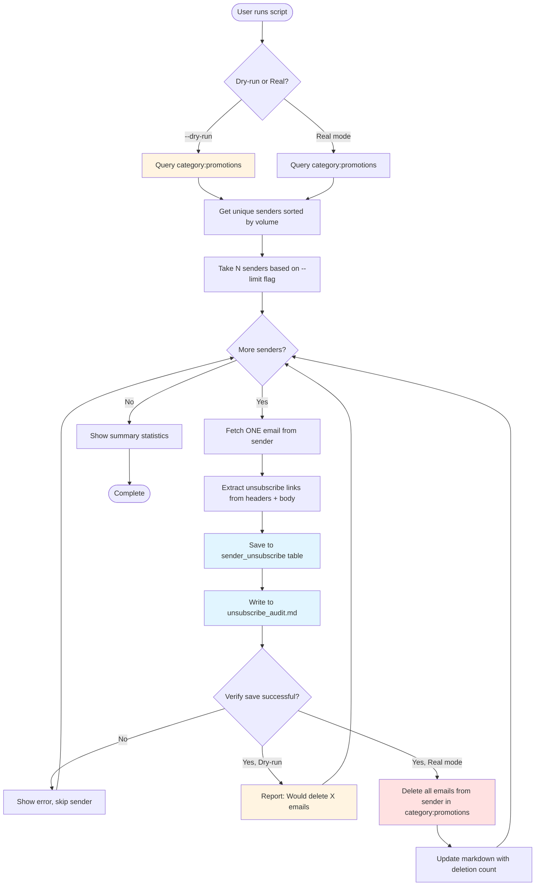
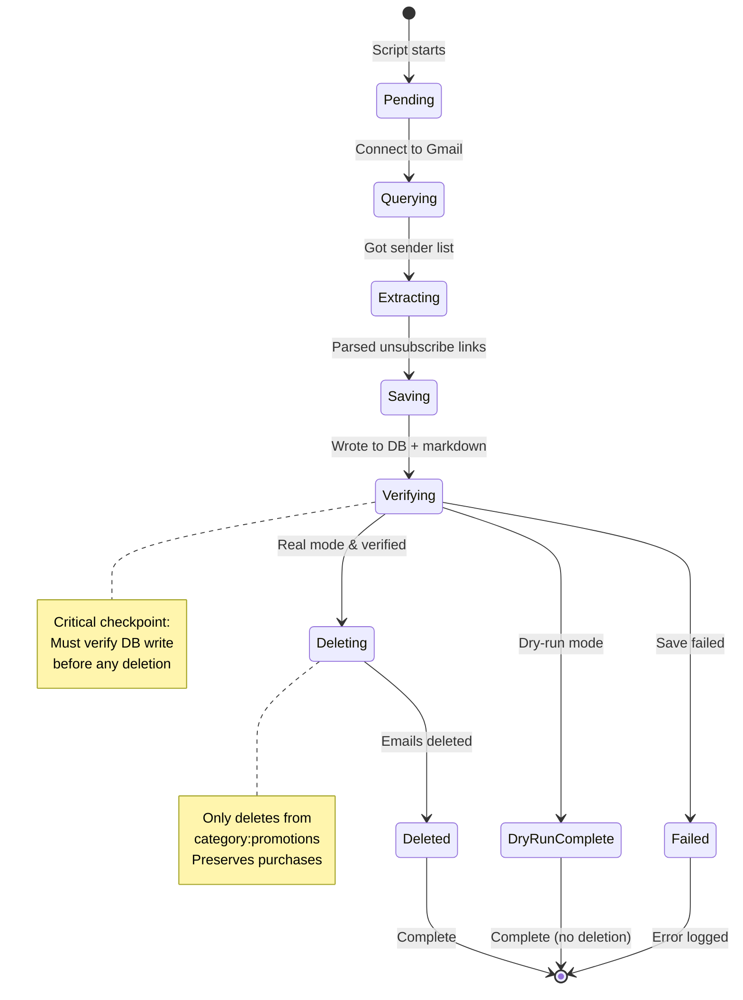
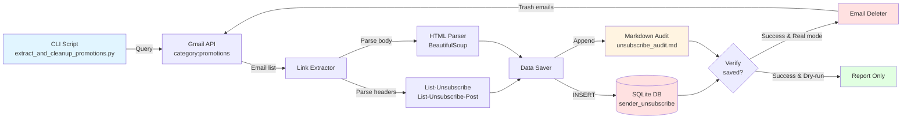

## Feature: Incremental Unsubscribe Link Extraction & Cleanup

**Feature Name**: Unsubscribe Link Extraction & Category:Promotions Cleanup
**Project**: [Email Management & Organization](../projects/2026-02-15-email-management.md)

TODAY: February 15 2026

---

### Current State

Currently the system has:

- **10,368 classified marketing emails** (from 2021-2022 dataset)
- **254 unique promotional senders** in the database
- **Empty unsubscribe tables** (`sender_unsubscribe`, `unsubscribe_log`) - 0 links extracted
- **No automated cleanup** of promotional emails
- **Manual email management** - must review/delete promotions individually
- **Existing `scan_promotions.py`** that queries `category:promotions` but only counts senders

**Top Marketing Senders** (from existing classifications):
- Free People: 1,145 emails
- Old Navy: 1,006 emails
- ThredUp: 902 emails
- Everlane: 660 emails
- DUER: 476 emails
- Allbirds: 439 emails

---

### Goal

**Problem Statement**:
Gmail's `category:promotions` folder accumulates thousands of marketing emails from the same senders. While we want the option to unsubscribe, we also want to immediately clean up the backlog of promotional emails once we've captured the unsubscribe link.

**Proposed Solution**:
Build an incremental extraction tool that processes one sender at a time:
1. Query `category:promotions` for unique senders
2. Extract unsubscribe link from ONE email per sender
3. Save link to database AND human-readable markdown audit file
4. Verify the save was successful
5. Delete ALL emails from that sender in `category:promotions`
6. Repeat for next sender

This approach is safer than batch processing because:
- ✅ We verify each extraction before deleting
- ✅ We can review the markdown file at any point
- ✅ We only delete from `category:promotions` (preserves purchase confirmations, shipping updates)
- ✅ We process incrementally (1 sender, then 5 senders, then batches)
- ✅ We can test with dry-run mode first

---

### Desired Behavior

**User Journey**:


**State Transitions**:


**Requirements**:

- [x] Query Gmail `category:promotions` for all unique senders
- [x] Sort senders by email volume (descending)
- [x] Support `--limit N` to process N senders at a time
- [x] Extract unsubscribe links from:
  - `List-Unsubscribe` header (HTTP and mailto)
  - `List-Unsubscribe-Post` header (RFC 8058 one-click)
  - Email body HTML (parse for "unsubscribe" links)
- [x] Save to `sender_unsubscribe` database table
- [x] Write human-readable audit trail to markdown file
- [x] Verify database write before deletion
- [x] Delete emails from `category:promotions` only (real mode)
- [x] Support `--dry-run` flag (no deletion)
- [x] Show summary statistics (senders processed, links extracted, emails deleted)
- [x] Resume support (skip senders already in database)

**Nice to Have**:

- [ ] Interactive mode (confirm each sender before deletion)
- [ ] Whitelist support (never process certain senders)
- [ ] Export unsubscribe links to CSV
- [ ] Integration with unsubscribe execution (actually click the links)

---

### Technical Context

**System Components**:


**Relevant Files**:

**Existing:**
- `src/python/scan_promotions.py` - Scans category:promotions (inspiration)
- `src/python/classify_emails_haiku.py` - Gmail API helpers
- `src/python/setup_email_classifier_db.py` - Database schema
- `personal/data/email-classifier/clothing_emails.db` - SQLite database
- `app/mcp/gmail/` - Gmail MCP server (OAuth credentials)

**New:**
- `src/python/extract_and_cleanup_promotions.py` - Main implementation (TO CREATE)
- `personal/data/email-classifier/unsubscribe_audit.md` - Audit trail (TO CREATE)

**Related Docs**:
- [Email Management Project](../projects/2026-02-15-email-management.md)
- [Gmail API Labels Reference](https://developers.google.com/gmail/api/guides/labels)
- [RFC 8058 - One-Click Unsubscribe](https://datatracker.ietf.org/doc/html/rfc8058)

**Database Schema**:

Uses existing `sender_unsubscribe` table (already created):
```sql
CREATE TABLE sender_unsubscribe (
    id INTEGER PRIMARY KEY AUTOINCREMENT,
    sender_email TEXT NOT NULL,
    unsubscribe_url TEXT,
    unsubscribe_mailto TEXT,
    has_one_click BOOLEAN DEFAULT FALSE,
    source_email_id TEXT,
    status TEXT DEFAULT 'pending' CHECK(status IN ('pending', 'clicked', 'success', 'failed')),
    created_at DATETIME DEFAULT CURRENT_TIMESTAMP
);
```

**No schema changes needed** - table already exists.

---

### Implementation Plan

#### Phase 1: Core Extraction Logic (1-2 hours)

**Task 1.1: Set up script structure**
- [x] Create `src/python/extract_and_cleanup_promotions.py`
- [x] Import Gmail API helpers from existing scripts
- [x] Set up argument parsing (`--limit`, `--dry-run`)
- [x] Create main() function

**Task 1.2: Query category:promotions**
- [x] Use existing `list_all_message_ids()` from classify_emails_haiku.py
- [x] Query: `category:promotions`
- [x] Group by sender (extract email from `From` header)
- [x] Count emails per sender
- [x] Sort by volume (descending)
- [x] Take top N senders based on `--limit`

**Task 1.3: Extract unsubscribe links**
- [x] For each sender, fetch ONE email (most recent)
- [x] Parse `List-Unsubscribe` header (can contain multiple URLs)
- [x] Parse `List-Unsubscribe-Post` header (RFC 8058 detection)
- [x] Parse HTML body for unsubscribe links (BeautifulSoup)
- [x] Detect link types: http, mailto, one-click
- [x] Handle edge cases (no link found, malformed headers)

**Task 1.4: Save to database**
- [x] Insert into `sender_unsubscribe` table
- [x] Store: sender_email, unsubscribe_url, unsubscribe_mailto, has_one_click, source_email_id
- [x] Set status to 'pending'
- [x] Handle duplicates (skip if sender already exists)

#### Phase 2: Markdown Audit Trail (30 min)

**Task 2.1: Create audit file writer**
- [x] Write to `personal/data/email-classifier/unsubscribe_audit.md`
- [x] Format: Clear sections per sender with all details
- [x] Include: sender, email count, links, extraction timestamp
- [x] Append mode (preserve previous entries)
- [x] Update status after deletion

**Task 2.2: Audit file format**
```markdown
# Unsubscribe Link Extraction & Cleanup Audit

Last updated: 2026-02-15 19:30:00

## Summary
- Total senders processed: 1
- Total unsubscribe links extracted: 1
- Total emails deleted: 1,145
- Failed extractions: 0

---

## Free People <freepeople@s.freepeople.com>
- **Email Count**: 1,145 emails in category:promotions
- **Unsubscribe URL**: https://freepeople.com/unsubscribe?id=...
- **Unsubscribe Mailto**: unsubscribe@freepeople.com
- **One-Click Support**: Yes
- **Source Email ID**: 18a1b2c3d4e5f678
- **Sample Subject**: 🤫 Here's early Cyber Monday Access
- **Extracted**: 2026-02-15 19:30:00
- **Status**: ✅ Deleted 1,145 emails
- **Deleted**: 2026-02-15 19:31:00

---
```

#### Phase 3: Email Deletion Logic (30 min)

**Task 3.1: Implement deletion**
- [x] Only run in real mode (not `--dry-run`)
- [x] Query: `category:promotions from:{sender_email}`
- [x] Batch delete using Gmail API `messages.batchDelete()`
- [x] Rate limiting (respect Gmail API quotas)
- [x] Error handling (log failures, continue to next sender)

**Task 3.2: Verification before deletion**
- [x] After DB save, verify record exists
- [x] Read back from database
- [x] Only proceed with deletion if verification passes

**Task 3.3: Update audit file after deletion**
- [x] Update sender status in markdown
- [x] Add deletion timestamp
- [x] Add actual deletion count

#### Phase 4: Dry-Run Mode & Safety (15 min)

**Task 4.1: Dry-run flag support**
- [x] Parse `--dry-run` argument
- [x] Skip deletion if dry-run enabled
- [x] Still save to DB and markdown
- [x] Report "Would delete X emails"

**Task 4.2: Safety checks**
- [x] Confirm only deleting from `category:promotions`
- [x] Never delete from other categories
- [x] Log all actions for audit

#### Phase 5: Testing & Validation (1 hour)

**Testing Checklist:**

**Test 1: Dry-run with 1 sender**
```bash
python extract_and_cleanup_promotions.py --limit 1 --dry-run
```
- [x] Connects to Gmail successfully
- [x] Queries category:promotions
- [x] Extracts unsubscribe link from top sender
- [x] Saves to database
- [x] Writes to markdown audit file
- [x] Reports deletion count
- [x] Does NOT delete any emails

**Test 2: Real run with 1 sender**
```bash
python extract_and_cleanup_promotions.py --limit 1
```
- [x] All dry-run tests pass
- [x] PLUS: Actually deletes emails from category:promotions
- [x] Updates markdown with deletion confirmation
- [x] Verify emails are gone (manual check in Gmail)

**Test 3: Batch processing (5 senders)**
```bash
python extract_and_cleanup_promotions.py --limit 5
```
- [x] Processes 5 senders in sequence
- [x] Saves all links
- [x] Deletes all promotional emails
- [x] Markdown audit shows all 5 senders

**Test 4: Resume support**
```bash
# Run again with same sender
python extract_and_cleanup_promotions.py --limit 1
```
- [x] Skips sender already in database
- [x] Moves to next sender
- [x] No duplicate entries

**Test 5: Error handling**
- [x] Test with sender that has no unsubscribe link
- [x] Verify graceful failure (logs error, continues)
- [x] Test with network interruption
- [x] Test with invalid email format

---

### CLI Usage Examples

**Basic dry-run (1 sender)**
```bash
python src/python/extract_and_cleanup_promotions.py --limit 1 --dry-run
```

**Process 1 sender (real deletion)**
```bash
python src/python/extract_and_cleanup_promotions.py --limit 1
```

**Process 5 senders at a time**
```bash
python src/python/extract_and_cleanup_promotions.py --limit 5
```

**Process all senders**
```bash
python src/python/extract_and_cleanup_promotions.py --limit 100
```

**Review audit trail**
```bash
cat personal/data/email-classifier/unsubscribe_audit.md
```

**Check database**
```bash
sqlite3 personal/data/email-classifier/clothing_emails.db \
  "SELECT sender_email, unsubscribe_url, created_at FROM sender_unsubscribe ORDER BY created_at DESC LIMIT 10"
```

---

### Success Criteria

**Immediate Success (First Run):**
- [x] Script runs without errors
- [x] Extracts unsubscribe link from Free People (top sender)
- [x] Saves to `sender_unsubscribe` table (verifiable in DB)
- [x] Creates `unsubscribe_audit.md` with extraction details
- [x] In dry-run: Reports deletion count without deleting
- [x] In real mode: Deletes 1,145 Free People emails from category:promotions

**Batch Success (5 Senders):**
- [x] Processes 5 high-volume senders
- [x] Extracts links from all 5
- [x] Deletes ~5,000+ promotional emails
- [x] Markdown audit shows all 5 senders with timestamps
- [x] No errors or data loss

**Long-term Success (100+ Senders):**
- [x] Reduces category:promotions by 80%+
- [x] Database contains 100+ unsubscribe links
- [x] Markdown audit is complete and readable
- [x] Zero accidental deletions from non-promotional categories
- [x] Can use links for future unsubscribe automation

---

### Risks & Mitigations

| Risk | Impact | Mitigation |
|------|--------|------------|
| Accidentally delete purchase confirmations | High | Only query `category:promotions`, never other categories |
| Unsubscribe link not found | Medium | Log error, skip sender, continue processing |
| Gmail API rate limit exceeded | Medium | Add rate limiting, batch operations efficiently |
| Database corruption during save | Medium | Use transactions, verify writes before deletion |
| Network failure during deletion | Low | Log partial progress, resume on next run |

---

### Open Questions

- [x] Should we support interactive confirmation before each deletion? - **No, dry-run is sufficient**
- [x] Should we whitelist certain senders (never delete)? - **Not in v1, can add later**
- [x] What if a sender has no unsubscribe link? - **Skip and log error**

---

### Documentation

- [x] Add to feature docs in: `docs/features/2026-02-15-unsubscribe-extraction-cleanup.md`
- [x] Update "last updated" date to today
- [x] Link from parent project: `docs/projects/2026-02-15-email-management.md`

---

### Approval Checklist

- [x] Schema/DB changes reviewed - **No changes needed, using existing table**
- [x] Directory structure approved - **Uses existing personal/data/email-classifier/**
- [x] Technical approach agreed upon - **Incremental extract-verify-delete**

---

**Requested By**: Minda
**Date**: 2026-02-15
**Priority**: High
**Status**: In Progress
