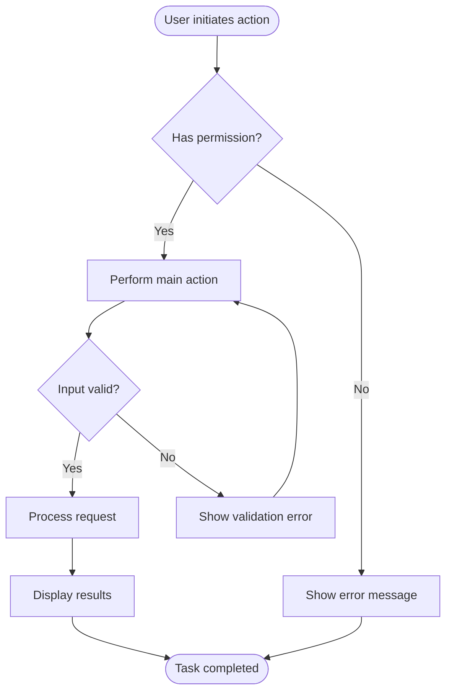
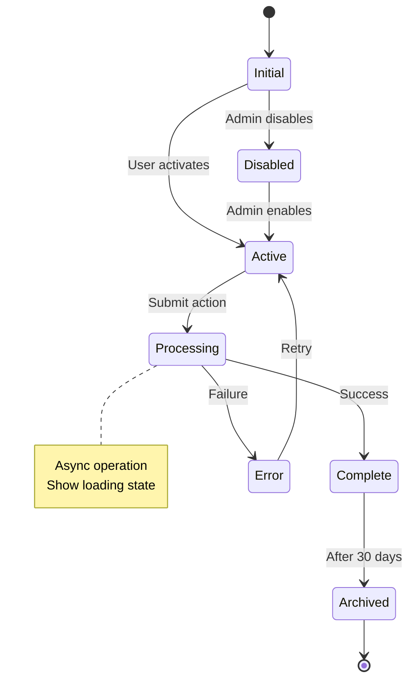
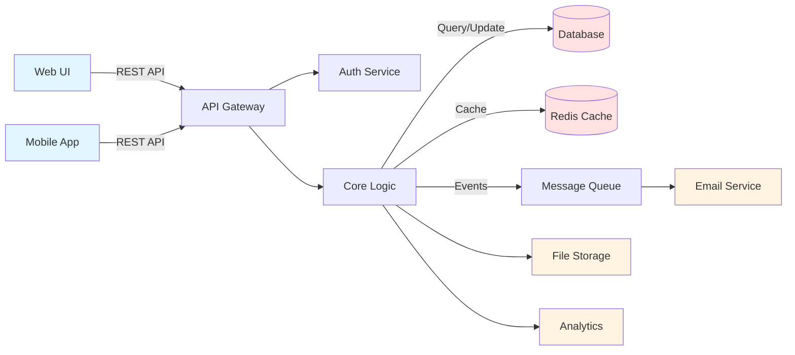

## Feature Request

**Feature Name**: [Short descriptive name]
**Project**: [Parent project name or link]

TODAY: [Month Day Year]

---

### Current State

Currently the app:

- [Describe current behavior 1]
- [Describe current behavior 2]
- [Describe current behavior 3]

---

### Goal

**Problem Statement**: [What problem does this solve for the user?]

**Proposed Solution**: [High-level description of how we'll solve it]

---

### Desired Behavior

[Describe how the feature should work]

**User Journey**:

**Requirements**:

- [ ] [Requirement 1]
- [ ] [Requirement 2]
- [ ] [Requirement 3]

**Nice to Have**:

- [ ] [Optional enhancement 1]
- [ ] [Optional enhancement 2]

**State Transitions** (if applicable):

---

### Technical Context

**System Components**:

**Relevant Files**:

- [file path 1]
- [file path 2]

**Related Docs**:

- [doc link 1]

**Database Changes**:

- [ ] New schema required? [Yes/No]
- [ ] Schema changes needed? [Yes/No]

---

### Documentation

- [ ] Add to feature docs in: [location]
- [ ] Update "last updated" date to today

---

### Open Questions

- [ ] [Question 1 - include options A, B, C if applicable]
- [ ] [Question 2]
- [ ] [Question 3]

---

### Approval Checklist

- [ ] Schema/DB changes reviewed
- [ ] Directory structure approved
- [ ] Technical approach agreed upon

---

**Requested By**: [Name]
**Date**: [YYYY-MM-DD]
**Priority**: [Low / Medium / High / Critical]
**Status**: [Draft / In Review / Approved / In Progress / Complete]