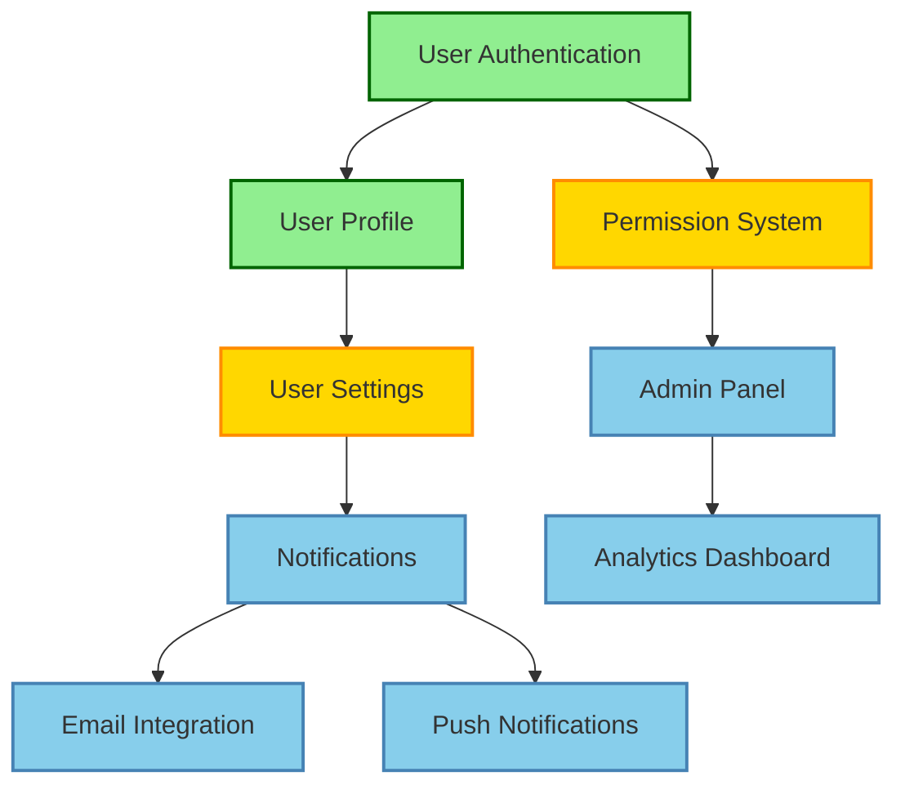
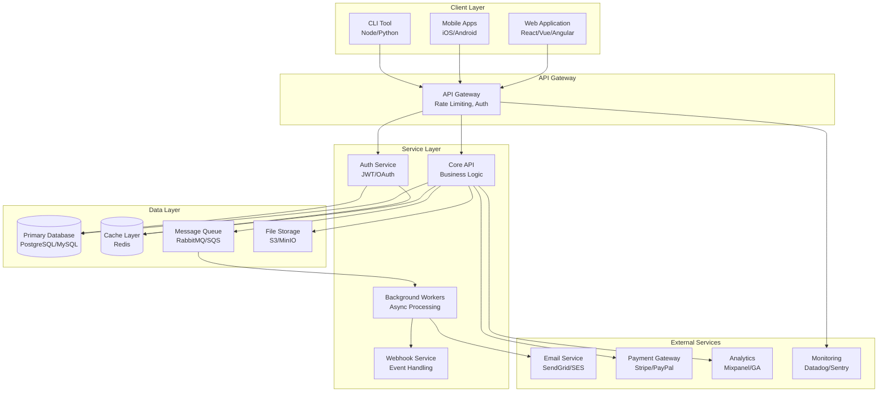
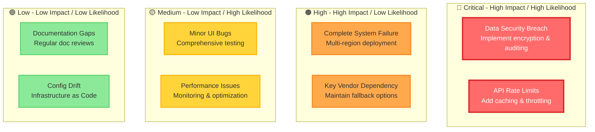

## Project: [Project Name]

**Category**: [Infrastructure & Tools / AI & Automation / Data & Analytics / Integrations / User Experience]

TODAY: [Month Day Year]

---

### Overview

[High-level description of what this project aims to accomplish]

---

### Problem Space

**What problems are we solving?**

- [Problem 1]
- [Problem 2]
- [Problem 3]

**Who is affected?**

- [User group 1]
- [User group 2]

---

### Goals

**Primary Goals**:

- [ ] [Main objective 1]
- [ ] [Main objective 2]
- [ ] [Main objective 3]

**Success Metrics**:

- [How we'll measure success 1]
- [How we'll measure success 2]

---

### Scope

**In Scope**:

- [What's included 1]
- [What's included 2]
- [What's included 3]

**Out of Scope**:

- [What's not included 1]
- [What's not included 2]

---

### Related Features

**Feature Dependency Graph**:

Features that are part of this project:

- [ ] [Feature 1] - [Status]
  - Link: `../features/YYYY-MM-DD-feature-name.md`
- [ ] [Feature 2] - [Status]
  - Link: `../features/YYYY-MM-DD-feature-name.md`
- [ ] [Feature 3] - [Status]
  - Link: `../features/YYYY-MM-DD-feature-name.md`

---

### Technical Architecture

**System Architecture Diagram**:

**Key Components**:

- [Component 1] - [Description]
- [Component 2] - [Description]

**Dependencies**:

- [External dependency 1]
- [External dependency 2]

**Technology Stack**:

- [Technology 1]
- [Technology 2]

---

### Milestones

**Phase 1**: [Name] - [Target Date]
- [ ] [Deliverable 1]
- [ ] [Deliverable 2]

**Phase 2**: [Name] - [Target Date]
- [ ] [Deliverable 1]
- [ ] [Deliverable 2]

**Phase 3**: [Name] - [Target Date]
- [ ] [Deliverable 1]
- [ ] [Deliverable 2]

---

### Risks & Mitigation

**Risk Assessment Matrix**:

| Risk | Impact | Likelihood | Mitigation |
|------|--------|------------|------------|
| [Risk 1] | High/Medium/Low | High/Medium/Low | [How to address] |
| [Risk 2] | High/Medium/Low | High/Medium/Low | [How to address] |

---

### Resources

**Documentation**:
- [Link to relevant docs]
- [Link to design docs]

**Related Projects**:
- [Link to related project]

**External References**:
- [Link to external resource]

---

### Team

**Project Lead**: [Name]
**Contributors**: [Names]
**Stakeholders**: [Names]

---

**Created**: [YYYY-MM-DD]
**Last Updated**: [YYYY-MM-DD]
**Status**: [Planning / In Progress / On Hold / Complete]
**Priority**: [Low / Medium / High / Critical]