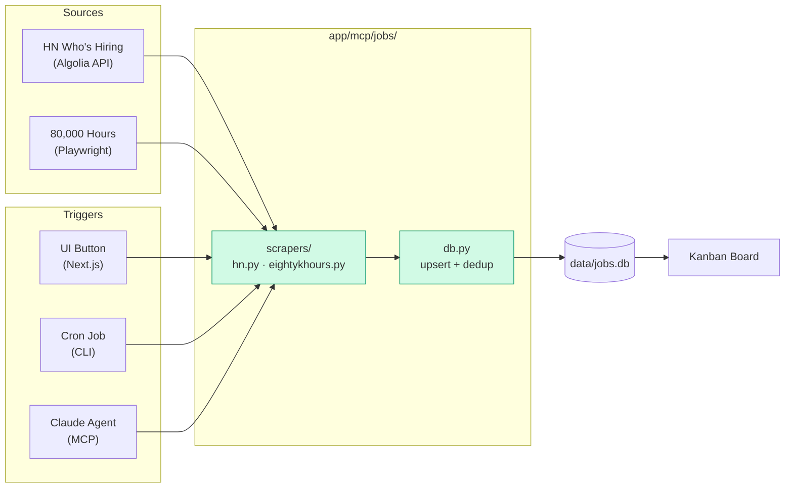
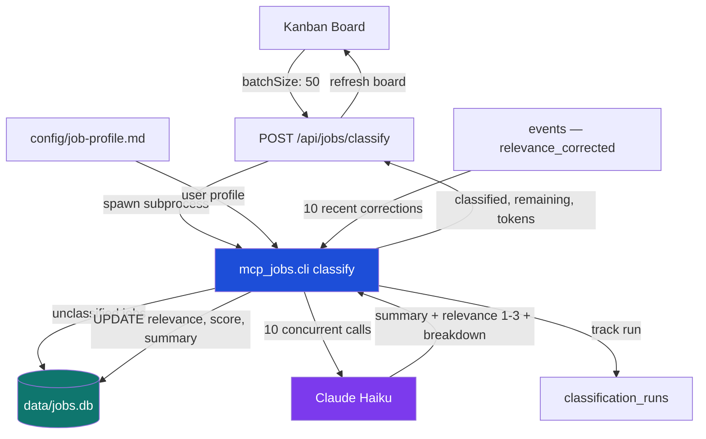
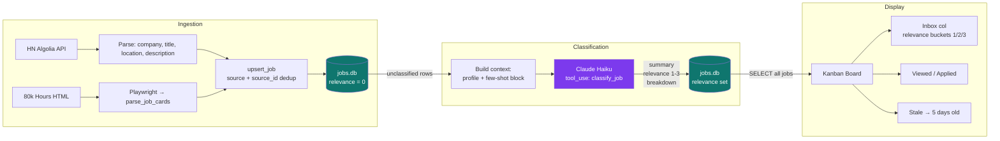

# Job Pipeline

**Status**: In Progress
**Last Updated**: 2026-03-03

---

## Overview

A personal job discovery and triage system. Scrapes job listings from multiple sources, stores them in SQLite, and surfaces them in a Kanban board with drag-and-drop triage and relevance ranking.

---

## Architecture

```
┌─────────────────────────────────────────────────────────┐
│  Trigger Paths                                          │
│                                                         │
│  UI button  → Next.js API → child_process → Python CLI  │
│  Cron job   → Python CLI directly                       │
│  Claude     → MCP tools  → Python core functions        │
└─────────────────────────────────────────────────────────┘
                              ↓
┌─────────────────────────────────────────────────────────┐
│  app/mcp/jobs/  (Python service)                        │
│                                                         │
│  mcp_jobs/                                              │
│  ├── scrapers/hn.py          Algolia API scraper        │
│  ├── scrapers/eightykhours.py  Playwright scraper       │
│  ├── classifier.py           Anthropic SDK classifier   │
│  ├── db.py                   SQLite helpers             │
│  ├── models.py               Pydantic schemas           │
│  ├── server.py               FastMCP tools for Claude   │
│  └── cli.py                  Cron / manual trigger      │
└─────────────────────────────────────────────────────────┘
                              ↓
┌─────────────────────────────────────────────────────────┐
│  data/jobs.db  (shared SQLite)                          │
│  Read by: Next.js (Drizzle ORM) + Python (aiosqlite)    │
└─────────────────────────────────────────────────────────┘
                              ↓
┌─────────────────────────────────────────────────────────┐
│  app/web/  (Next.js 16 + React 19)                      │
│                                                         │
│  Kanban board with drag-and-drop triage                 │
│  Scrape buttons (HN + 80k Hours)                        │
│  Job detail panel with relevance, star, dismiss         │
└─────────────────────────────────────────────────────────┘
```

---

## Data Flow



---

## Classifier

Jobs are classified by Claude Haiku using tool use for structured output. The classifier runs in batches, uses few-shot calibration from user corrections, and records token usage in `classification_runs`.



### Input Flow

How a raw job posting becomes a classified, ranked card on the board:



---

## Sources

| Source | Method | Status | Age limit | Notes |
|--------|--------|--------|-----------|-------|
| HN "Who is Hiring" | Algolia API | ✅ Active | 7 days | Monthly thread, ~500 jobs |
| 80,000 Hours | Playwright (browser) | ✅ Active | 7 days | CSS selectors need verification on first run |

---

## Relevance Scale

Jobs are rated on a **3-point scale** (plus unclassified):

| Value | Meaning |
|-------|---------|
| 0 | Unclassified — not yet evaluated |
| 1 | Perfect match — meets most criteria |
| 2 | Good match — meets some criteria, worth reviewing |
| 3 | Distant match — tangentially related |

Jobs are also dismissible (X button) and starrable (★ button), both with optional reasons recorded in the events table.

---

## Key Files

| File | Purpose |
|------|---------|
| [app/mcp/jobs/mcp_jobs/scrapers/hn.py](../../../app/mcp/jobs/mcp_jobs/scrapers/hn.py) | HN scraper — port of original TypeScript |
| [app/mcp/jobs/mcp_jobs/scrapers/eightykhours.py](../../../app/mcp/jobs/mcp_jobs/scrapers/eightykhours.py) | 80k Hours Playwright scraper |
| [app/mcp/jobs/mcp_jobs/db.py](../../../app/mcp/jobs/mcp_jobs/db.py) | SQLite helpers: upsert, dedup, run tracking |
| [app/mcp/jobs/mcp_jobs/server.py](../../../app/mcp/jobs/mcp_jobs/server.py) | FastMCP server (Claude tools) |
| [app/mcp/jobs/mcp_jobs/cli.py](../../../app/mcp/jobs/mcp_jobs/cli.py) | CLI for cron jobs |
| [app/mcp/jobs/tests/](../../../app/mcp/jobs/tests/) | pytest test suite |
| [app/web/src/modules/jobs/](../../../app/web/src/modules/jobs/) | TypeScript schema, DB client |
| [app/web/src/app/(jobs)/jobs/](../../../app/web/src/app/(jobs)/jobs/) | Kanban UI components |
| [app/web/src/app/api/jobs/](../../../app/web/src/app/api/jobs/) | Next.js API routes |
| [config/job-profile.md](../../../config/job-profile.md) | User preferences for filtering & classification |

---

## Running

```bash
# Start the Next.js dev server
cd app/web
pnpm dev          # or: npm run dev
```

Runs at `http://localhost:3000`. Jobs page at `/jobs`.

---

## Testing

### Python tests (fast — no network, no browser)

```bash
cd app/mcp/jobs

# Run all fast tests (default)
~/.local/bin/uv run pytest

# Verbose
~/.local/bin/uv run pytest -v

# Specific file
~/.local/bin/uv run pytest tests/test_hn_parser.py -v

# Specific test class
~/.local/bin/uv run pytest tests/test_db.py::TestUpsertJob -v
```

### Python tests (integration — hits real network / opens browser)

```bash
# Skipped by default. Opt in explicitly:
~/.local/bin/uv run pytest -m integration -v
```

### CLI smoke test (manual)

```bash
cd app/mcp/jobs

# Scrape HN (hits real Algolia API, writes to data/jobs.db)
~/.local/bin/uv run python -m mcp_jobs.cli scrape --source hn

# Scrape 80k Hours (opens Playwright browser)
~/.local/bin/uv run python -m mcp_jobs.cli scrape --source 80k --show-browser

# JSON output (used by Next.js API routes)
~/.local/bin/uv run python -m mcp_jobs.cli scrape --source hn --json

# Delete jobs (with confirmation)
~/.local/bin/uv run python -m mcp_jobs.cli delete --source hn --before 2025-02-01

# Delete all jobs from a source
~/.local/bin/uv run python -m mcp_jobs.cli delete --source 80k

# Preview deletion without actually deleting
~/.local/bin/uv run python -m mcp_jobs.cli delete --source hn --dry-run

# Delete without confirmation (for scripts)
~/.local/bin/uv run python -m mcp_jobs.cli delete --all --force
```

---

## Cron Setup

```bash
# Daily scrape at 9am every Monday (both sources)
0 9 * * 1 cd /path/to/DigitalBrain/app/mcp/jobs && ~/.local/bin/uv run python -m mcp_jobs.cli scrape --all
```

---

## MCP Setup (for Claude Desktop)

```bash
cd app/mcp/jobs
~/.local/bin/uv run mcp install mcp_jobs/server.py --name jobs
```

Exposes three tools to Claude: `scrape_hn_jobs`, `scrape_80k_hours_jobs`, `scrape_all_jobs`.

---

## Related Docs

- [app/web/src/app/(jobs)/jobs/README.md](../../../app/web/src/app/(jobs)/jobs/README.md) — detailed schema, API reference, test cases (plain English), classification pipeline

---

## Changelog

### Python Classifier + Scrape Panel — 2026-03-03 Added

Implemented the Python job classifier and consolidated the scrape UI into a checkbox panel.

- `mcp_jobs/classifier.py` — Claude Haiku classifier using tool use for structured output; loads `config/job-profile.md`; few-shot calibration from `relevance_corrected` events; 10 concurrent API calls per batch; records runs in `classification_runs`
- `mcp_jobs/cli.py` — Added `classify` command: `--batch-size`, `--force`, `--json`
- `app/api/jobs/classify/route.ts` — Updated to call Python CLI subprocess (same pattern as scrape route); dropped TypeScript classifier dependency
- `app/api/jobs/scrape/route.ts` — Accepts `source` body param (`hn` or `80k`), replacing two separate routes
- `jobs/scrape-panel.tsx` — Replaces separate HN and 80k buttons with a unified checkbox panel (select sources + scrape); check/uncheck all toggle; runs sources sequentially

Files: `app/mcp/jobs/mcp_jobs/classifier.py`, `app/mcp/jobs/mcp_jobs/cli.py`, `app/web/src/app/api/jobs/classify/route.ts`, `app/web/src/app/api/jobs/scrape/route.ts`, `app/web/src/app/(jobs)/jobs/scrape-panel.tsx`

---

### Job Deletion Commands — 2025-03-03 Added

CLI commands to delete jobs from the database with flexible filtering options.

- `mcp_jobs/db.py` — Added `delete_jobs()` and `count_jobs()` functions with shared filter interface
  - Filters: `source` (hn, 80k), `before_date`, `after_date`
  - Both functions accept the same parameters for consistency
  - Returns deletion count / job count
- `mcp_jobs/cli.py` — Added `delete` command with comprehensive options:
  - `--all` — Delete all jobs (requires confirmation)
  - `--source [hn|80k]` — Filter by source
  - `--before DATE` — Delete jobs discovered before date (ISO format)
  - `--after DATE` — Delete jobs discovered after date
  - `--between START END` — Delete jobs in date range
  - `--dry-run` — Preview count without deleting
  - `--force` — Skip confirmation prompt (for scripts)
  - `--json` — Output as JSON
- `tests/test_delete.py` — Comprehensive test suite (26 tests):
  - `TestCountJobs` — Count with all filter combinations
  - `TestDeleteJobs` — Delete with all filter combinations
  - Tests edge cases: empty database, no matches, date ranges

Files: `app/mcp/jobs/mcp_jobs/db.py`, `app/mcp/jobs/mcp_jobs/cli.py`, `app/mcp/jobs/tests/test_delete.py`

---

### Relevance Scale 1–3 UI Update — 2026-03-03 Changed

Updated the entire web UI and classifier to use the 3-point relevance scale (1=Perfect, 2=Good, 3=Distant) instead of the old 1–5 scale.

- `relevance-section.tsx` — Type narrowed to `0|1|2|3`; `RELEVANCE_CONFIG` updated: 1=Perfect Match (emerald), 2=Good Match (blue), 3=Distant Match (amber); render order is `[1, 2, 3, 0]`
- `kanban-board.tsx` — Type narrowed; buckets initialised as `{1,2,3,0}`; bucket clamp changed to `≤3`; `handleRelevanceChange` signature updated
- `job-detail-panel.tsx` — Replaced 5-star rating UI with three labeled buttons (Perfect / Good / Distant); AI Breakdown sub-scores display `/3` instead of `/5`
- `app/api/jobs/[id]/route.ts` — Validation now rejects `relevance > 3`; error message updated
- `modules/jobs/classifier.ts` — Zod schema descriptions updated to 1–3; system prompt updated with new labels; clamp changed to `Math.min(3, …)`

---

### Python Jobs Service — 2026-03-03 Added

Built a Python-based jobs scraping service (`app/mcp/jobs/`) replacing the TypeScript-only pipeline, adding 80,000 Hours as a second source, and exposing all scraping functionality via MCP, CLI, and Next.js API routes.

- Created `app/mcp/jobs/` Python service following the Gmail MCP pattern
- `mcp_jobs/db.py` — async SQLite helpers (aiosqlite) shared with the Next.js Drizzle layer; upsert with source+source_id dedup; scrape run CRUD; `is_too_old()` age filter (7-day cutoff)
- `mcp_jobs/models.py` — Pydantic schemas: `Job`, `ScrapeResult`, `ClassifyResult`
- `mcp_jobs/scrapers/hn.py` — Port of the TypeScript HN scraper; calls Algolia API via httpx; pure parse functions; word-boundary regex for location matching
- `mcp_jobs/scrapers/eightykhours.py` — New Playwright scraper; anti-detection setup; session persistence via `.auth/eightykhours_state.json`; pure `parse_job_cards()` for testability
- `mcp_jobs/server.py` — FastMCP server exposing `scrape_hn_jobs`, `scrape_80k_hours_jobs`, `scrape_all_jobs` tools to Claude
- `mcp_jobs/cli.py` — Click CLI with `--source [hn|80k]`, `--all`, `--show-browser`, `--json` flags
- pytest suite: `test_hn_parser.py`, `test_db.py`, `test_hn_scraper.py` (respx mocks), `test_eightykhours_parser.py` (HTML fixtures)

Node.js integration:
- `app/web/src/app/api/jobs/scrape/route.ts` — Updated to call Python CLI via `child_process.spawn`
- `app/web/src/app/api/jobs/scrape-80k/route.ts` — New route for 80k source
- `app/web/src/app/(jobs)/jobs/scrape-80k-button.tsx` — New "Scrape 80k Hours" button

---

### Scrape Button 80k Hours — 2026-03-03 Added

Added a second scrape button to the jobs Kanban page for 80,000 Hours.

- `scrape-80k-button.tsx` — mirrors `scrape-button.tsx` structure; calls `/api/jobs/scrape-80k`
- Displays "Scraping…" loading state, success message with job count, or error message
- Refreshes the Kanban via `router.refresh()` on success

---

### Requirements Documentation — 2026-03-03 Added

Added plain-English test cases to `app/web/src/app/(jobs)/jobs/README.md`.

- TC-S1–TC-S10: Scraping requirements (fresh scrape, dedup, age filter, field parsing, session reuse)
- TC-R1–TC-R2: Relevance scale constraints
- TC-U1–TC-U5: UI interactions (dismiss with reason, star with reason, optimistic updates, undo)

---

## Known Limitations / Pending

- 80k Hours CSS selectors are unverified — run `--show-browser` on first use to confirm
- `PATCH /api/jobs/:id` in Node.js does not yet enforce `relevance ≤ 3`
- X (dismiss) button and star-with-reason UI components (TC-U1–TC-U5) not yet implemented
